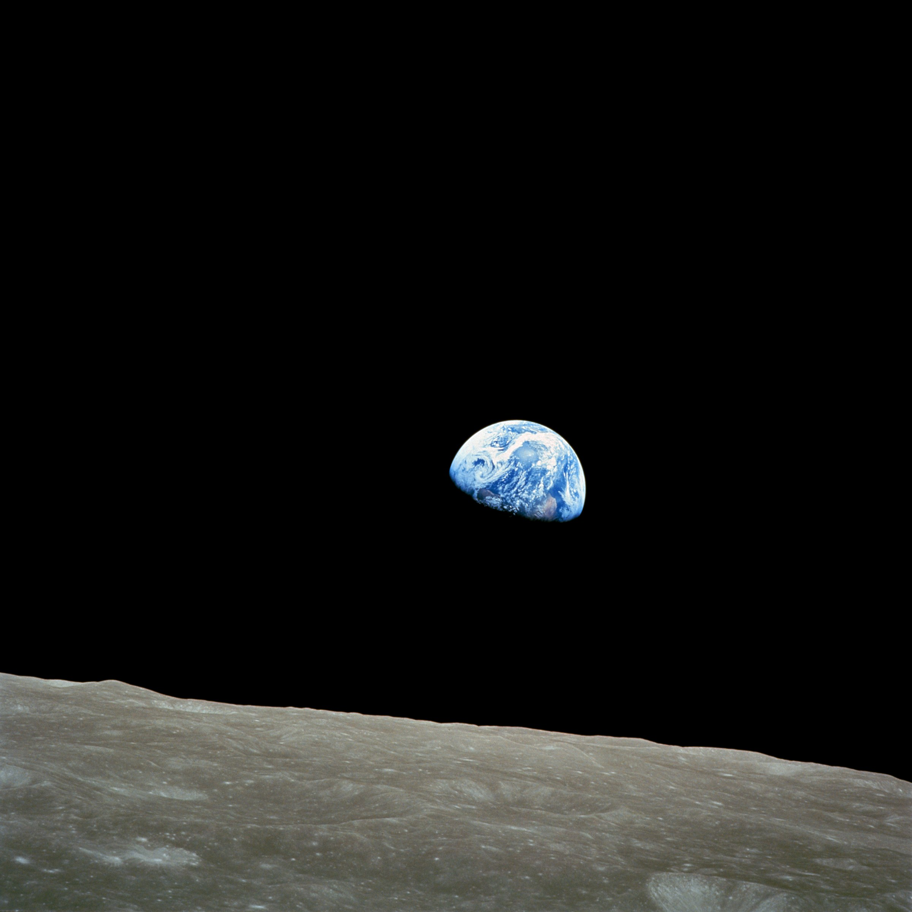
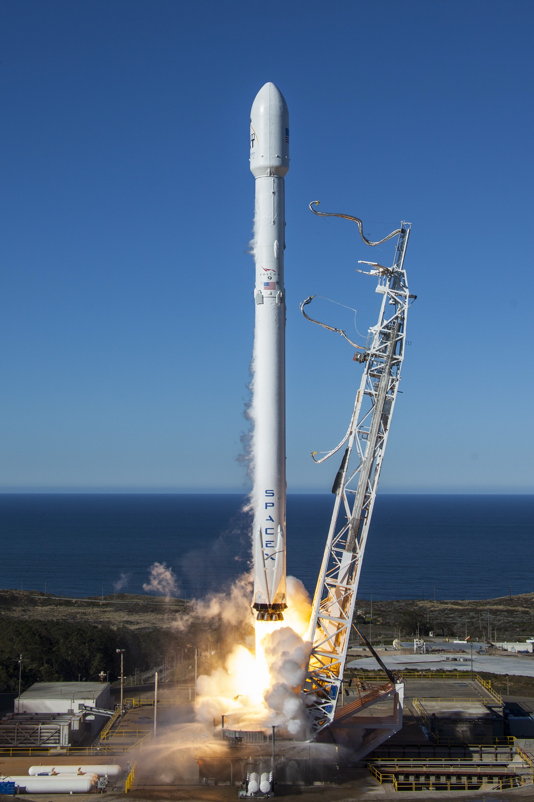
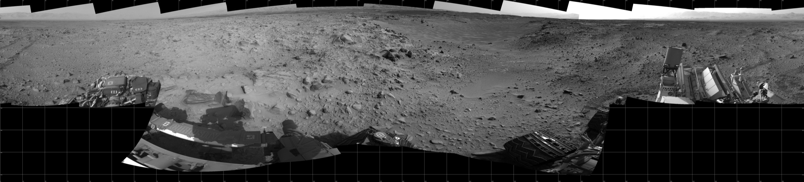
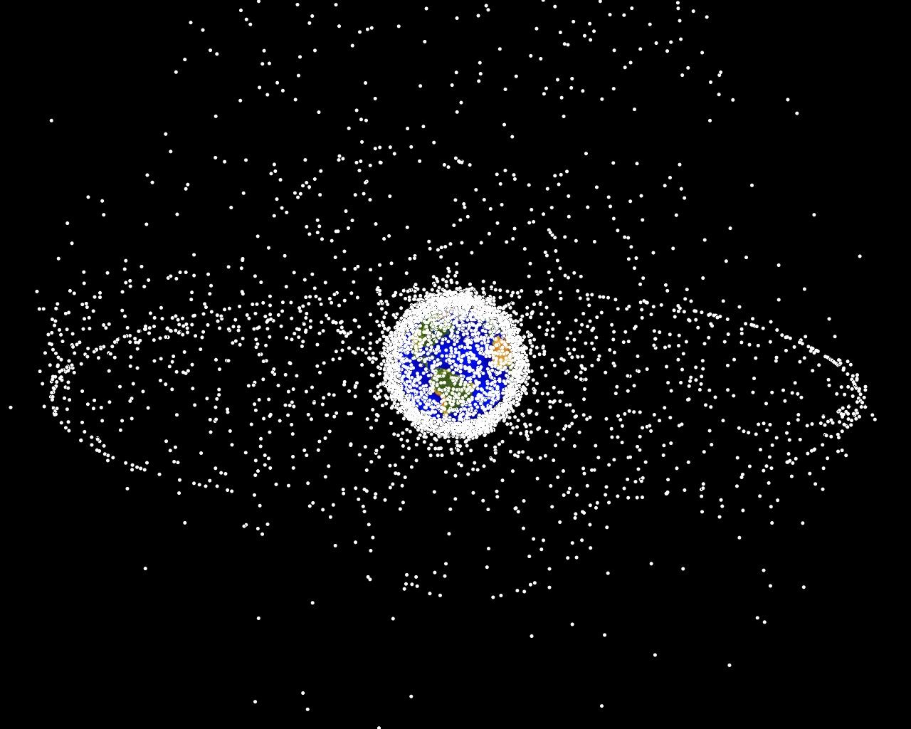
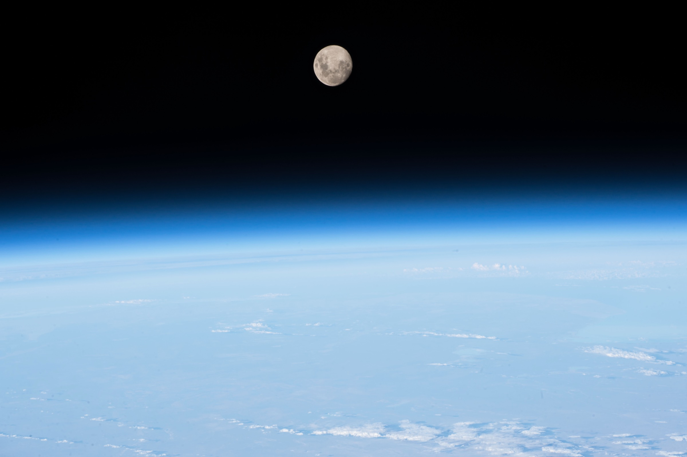
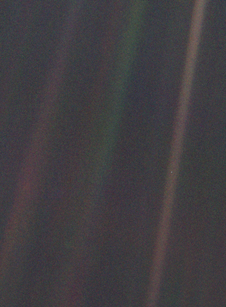

# Last Week's Strategy: The Cliffhanger Return

---

## Quick Callback

::: {style="font-size: 1.6em; line-height: 1.8;"}
Last week's strategy: **The Cliffhanger Return**

*Your last line should echo your first — transformed.*

**Anyone try it?** Did you bookend your presentation by returning to your opening image or story?
:::

---

## Something You Took Away Last Week

::: {style="font-size: 1.5em; line-height: 1.8;"}
Week 10 gave you the full picture: **cascade effects and tipping points.**

Wolves reintroduced to Yellowstone literally changed the course of rivers. The Aral Sea disappeared because of cotton. Permafrost holds 1,700 gigatonnes of carbon — twice what's in the atmosphere right now.

Every climate decision is a fork. Some you can walk back. Some are one-way doors.
:::

::: {style="font-size: 1.4em; margin-top: 30px; font-weight: bold; color: #8e44ad;"}
So what if you could see all of those connections at once? What if you could see Earth from *outside?*
:::

---

## Quick W10 Recap: Cascade Effects

::: {style="font-size: 1.4em; line-height: 1.8;"}
Three things from last week you need to hold onto:

**1. The decision tree** — every intervention forks the system onto a new path. Some forks are reversible (wolves came back). Some are one-way doors (Aral Sea is gone).

**2. Feedback loops feed themselves** — permafrost → methane → warming → more thawing. Ice → dark water → heat → less ice. Once started, the system accelerates.

**3. We're closer than you think** — the Amazon is 3% from a potentially irreversible tipping point. The question isn't whether to act. It's whether the door is still open.
:::

::: {style="font-size: 1.5em; margin-top: 25px; font-weight: bold; color: #c0392b;"}
Now: zoom out. All the way out. What does the whole system look like from space?
:::

---

## From Cascade Effects → The View From Above

::: {style="font-size: 1.5em; line-height: 1.8;"}
Last week: *"Everything is connected — pull one thread, everything moves."*

This week: *"What if perspective itself is the tool?"*

**The Overview Effect.**

Astronauts who see Earth from space report a permanent shift in how they think about borders, nations, and environmental destruction. They call it the Overview Effect.

This is our final week. It's not an accident that we end here.
:::

::: {style="font-size: 1.3em; margin-top: 25px; background: #f0f0f0; padding: 20px; border-radius: 10px;"}
Your full toolkit: Spectacle Formula → Complexity → System Boundaries → Timing → Built Environment → Structural Incentives → The Doubt Machine → Invisible Infrastructure → Responsibility Asymmetry → Cascade Effects → **Perspective.**
:::

---

## {background-color="#000000"}

::: {style="text-align: center;"}
{width="65%"}
:::

::: {style="font-size: 1.3em; text-align: center; color: #ccc; margin-top: 20px;"}
*"We came all this way to explore the Moon, and the most important thing is that we discovered the Earth." — Bill Anders*
:::

---

# This Week's Battlefield

---

## Two Sides. Two Futures for Humanity.

::: {style="display: flex; justify-content: space-around; margin-top: 50px;"}
::: {style="text-align: center; width: 45%; background: #27ae60; color: white; padding: 50px; border-radius: 15px;"}
::: {style="font-size: 2.5em; font-weight: bold;"}
PRO-CLIMATE
:::
::: {style="font-size: 1.3em; margin-top: 20px;"}
= Fix Earth First

= "Space is escapism for billionaires"
:::
:::

::: {style="text-align: center; width: 45%; background: #3498db; color: white; padding: 50px; border-radius: 15px;"}
::: {style="font-size: 2.5em; font-weight: bold;"}
PRO-DEVELOPMENT
:::
::: {style="font-size: 1.3em; margin-top: 20px;"}
= Explore & Expand

= "Humanity needs a backup plan"
:::
:::
:::

---

## The Core Tension

::: {style="font-size: 1.6em; line-height: 1.8;"}
| PRO-CLIMATE | PRO-DEVELOPMENT |
|-------------|-----------------|
| Fix problems here first | Innovation needs frontiers |
| Resources for Earth | Investment in future tech |
| Billionaire vanity projects | Human species survival |
| Rocket emissions matter | Space tech benefits everyone |
| One planet is enough | Don't put all eggs in one basket |

**This tension defines debates about humanity's future.**
:::

---

# The New Space Race

---

## {background-color="#000000"}

::: {style="text-align: center;"}
{width="45%"}
:::

::: {style="font-size: 1.5em; text-align: center; color: #ccc; margin-top: 20px;"}
*This rocket is worth more than the climate adaptation budget of the 50 poorest countries combined.*
:::

---

## From Nations to Billionaires

::: {style="font-size: 1.4em; line-height: 1.8;"}
**Then (1957–1972): Government-led**

- USA vs USSR — Sputnik, Apollo, Moon landing
- Apollo program budget: ~$25.4 billion (~$150 billion in today's dollars)
- Driven by national pride and Cold War competition

**Now (2020s): Private-led**

- **Elon Musk (SpaceX)** — Mars colonization. Launched a Tesla into space. Valuation: >$100 billion.
- **Jeff Bezos (Blue Origin)** — Space tourism. "We need to move heavy industry into space."
- **Virgin Galactic** — Suborbital tourism at $250,000/seat. Now struggling financially.
:::

::: {style="font-size: 1.4em; margin-top: 20px; font-weight: bold; color: #c0392b;"}
The space race used to be about national survival. Now it's about who can afford a ticket.
:::

---

## The Environmental Cost

::: {style="font-size: 1.5em; line-height: 1.8;"}
Space exploration has an emissions problem nobody talks about:

- A single rocket launch can release [**~300 tonnes of CO₂**]{style="color: #e74c3c;"}
- SpaceX alone launched **98 missions in 2023**
- Black carbon from rocket exhaust in the stratosphere is [**500x more warming**]{style="color: #e74c3c;"} per unit mass than surface-level soot
- As space tourism scales, this gets worse — not better
:::

::: {style="font-size: 1.3em; margin-top: 20px; background: #f9e79f; padding: 20px; border-radius: 10px;"}
**Honest caveat:** Total rocket emissions are still tiny compared to aviation (~1 Gt/year) or industry. The concern isn't today's volume — it's the trajectory as launches multiply.
:::

---

# The "Escape Plan" Debate

---

## {background-color="#000000"}

::: {style="text-align: center;"}
{width="85%"}
:::

::: {style="font-size: 1.5em; text-align: center; color: #ccc; margin-top: 20px;"}
*Earth has everything. Mars has nothing. And somehow Mars is the plan.*
:::

---

## Two Ways to Read Mars Colonization

::: {style="display: flex; justify-content: space-around; margin-top: 30px;"}
::: {style="text-align: left; width: 45%; background: #27ae60; color: white; padding: 30px; border-radius: 10px;"}
::: {style="font-size: 1.3em; font-weight: bold;"}
The Critique: Escapism
:::
::: {style="font-size: 1.2em; line-height: 1.6; margin-top: 15px;"}
- Mars colonization is a **fantasy for the ultra-wealthy** — a lifeboat for billionaires while the rest of us drown
- It diverts attention and resources from fixing Earth
- Terraforming Mars would take **centuries**. We have **decades** to save Earth.
- Stephen Hawking argued we need a backup. But Hawking also said: *fix this one first*
:::
:::

::: {style="text-align: left; width: 45%; background: #3498db; color: white; padding: 30px; border-radius: 10px;"}
::: {style="font-size: 1.3em; font-weight: bold;"}
The Case: Insurance
:::
::: {style="font-size: 1.2em; line-height: 1.6; margin-top: 15px;"}
- The dinosaurs didn't have a space program. **They're extinct.**
- One asteroid and everything we've built — every symphony, every cure — **gone forever**
- Space tech spins off into climate solutions: GPS, weather satellites, fire detection from orbit
- It's not either/or — you can invest in both
:::
:::
:::

::: {.notes}
**Engagement prompt:** "If you had $100 billion — Elon Musk money — would you spend it on Mars or on Earth? And before you answer: what if the next Chicxulub-sized asteroid is already on its way?"
:::

---

# Space Debris: The Cascade We're Building in Orbit

---

## {background-color="#000000"}

::: {style="text-align: center;"}
{width="70%"}
:::

::: {style="font-size: 1.5em; text-align: center; color: #ccc; margin-top: 20px;"}
*We're building a Tragedy of the Commons in orbit.*
:::

---

## The Kessler Cascade

::: {style="font-size: 1.5em; line-height: 1.8;"}
Remember W10? **Cascade effects.**

The **Kessler Syndrome** is a cascade effect in space:

- Two objects collide → fragments → more collisions → more fragments → exponential debris growth
- At some threshold, **orbital space becomes unusable** — satellites, GPS, weather monitoring, communications — all destroyed
- We've already had collisions: 2009 Iridium-Cosmos crash created 2,000+ trackable fragments

[**500,000+ pieces** of debris are being tracked. Millions more are too small to see but lethal at 28,000 km/h.]{style="color: #e74c3c;"}
:::

::: {style="font-size: 1.3em; margin-top: 20px; font-weight: bold; color: #c0392b;"}
This is W6 (Tragedy of the Commons) + W10 (Cascade Effects) — in orbit. No one owns space. Everyone uses it. Nobody cleans up.
:::

---

## Space Is Now a Battlefield

::: {style="font-size: 1.4em; line-height: 1.8;"}
While billionaires race to Mars, governments are **militarising orbit**:

- **US Space Force** (2019) — a new branch of the military, dedicated to space warfare
- **"Department of War"** — proposals to rename the Department of Defense. What does that name change signal?
- **China's Chang'e Program** — lunar ambitions with strategic implications
- **Anti-satellite weapons** — tested by the US, Russia, China, and India. Each test creates thousands of new debris fragments (→ Kessler cascade).
:::

---

## The Power of Renaming

::: {style="font-size: 1.4em; line-height: 1.8;"}
After W7, you know how to read this. **Naming is a persuasion tool.**

| Old Name | New Name | What Changed? |
|----------|----------|---------------|
| Department of **Defense** | Department of **War** | Same budget. Same weapons. But "war" signals **aggression**, not protection. It reshapes what the public expects. |
| Space **Exploration** | Space **Force** | Same rockets. But "force" signals **dominance**, not curiosity. It justifies military spending. |
| **Global warming** | **Climate change** | Same physics. But "change" sounds less urgent than "warming." (W7: Trump used this switch to manufacture doubt.) |
| **Carbon footprint** | *Invented by BP in 2005* | Same emissions. But "footprint" shifts blame from **industry to you**. (W6: structural incentives.) |
:::

::: {style="font-size: 1.4em; margin-top: 20px; font-weight: bold; color: #c0392b;"}
A name isn't just a label. It's a **frame**. It tells the audience what to feel before they think. Every name in this table was a strategic choice by someone who understood persuasion.
:::

::: {.notes}
**Engagement prompt:** "Which renaming in this table is the most manipulative? And — honest question — have any of the renamings YOU'VE used in your debates this semester done the same thing? That's Strategy #10: you persuade yourself that your framing is neutral. It never is."
:::

---

# The Overview Effect

---

## {background-color="#000000"}

::: {style="text-align: center;"}
{width="80%"}
:::

::: {style="font-size: 1.5em; text-align: center; color: #ccc; margin-top: 20px;"}
*Everything we've discussed this semester — structural incentives, the doubt machine, the ocean, refugees, cascades — happens inside that razor-thin blue line.*
:::

---

## See It: The Overview Effect



::: {style="font-size: 1.1em; margin-top: 10px; color: #7f8c8d; text-align: center;"}
*Planetary Collective (~19 min). Five astronauts describe what happens when you see Earth from space. Watch the first 5–7 minutes — that's enough to feel it.*
:::

---

## {background-color="#0a0a2e"}

::: {style="font-size: 1.8em; text-align: center; padding: 60px; color: white; line-height: 1.8;"}
*"You develop an instant global consciousness, a people orientation, an intense dissatisfaction with the state of the world, and a compulsion to do something about it."*

— **Edgar Mitchell**, Apollo 14
:::

::: {style="font-size: 1.5em; text-align: center; margin-top: 30px; font-weight: bold; color: #e74c3c;"}
That's not poetry. That's a **data point from someone who saw the system from outside.**
:::

---

## {background-color="#000000"}

::: {style="text-align: center;"}
{width="40%"}
:::

::: {style="font-size: 1.3em; text-align: center; color: #ccc; margin-top: 20px;"}
*"Look again at that dot. That's here. That's home. That's us." — Carl Sagan*
:::

---

## The Human Story: Perspective Changes Everything

::: {style="font-size: 1.4em; line-height: 1.8;"}
**Every astronaut** who sees Earth from space reports the same thing: profound awe at Earth's fragility and unity. Borders disappear. The atmosphere looks impossibly thin.

**PRO-CLIMATE says:** "That's the point! They realize Earth is all we have. Stop going to space — start protecting home."

**PRO-DEVELOPMENT says:** "That's also the point! Only by going to space do we truly understand Earth. The environmental movement was born from the Apollo 8 Earthrise photo."

**The real question:** Does space exploration wake us up to Earth's fragility — or distract us from saving it?
:::

::: {.notes}
**Engagement prompt:** "The modern environmental movement is often traced back to the Earthrise photo — an image only possible because we went to space. So did space exploration cause environmentalism? And if so, is more space exploration the answer?"
:::

---

# Building Your Final Spectacle

---

## The Formula (One Last Time)

::: {style="font-size: 1.8em; line-height: 1.8;"}
**Fact** + **Human Story** + **Stakes** = **Spectacle**
:::

::: {style="display: flex; justify-content: space-around; margin-top: 50px;"}
::: {style="text-align: center; width: 30%; background: #ecf0f1; padding: 30px; border-radius: 10px;"}
::: {style="font-size: 1.2em; font-weight: bold;"}
Weak
:::
"Space exploration costs money"
:::

::: {style="text-align: center; width: 30%; background: #f39c12; color: white; padding: 30px; border-radius: 10px;"}
::: {style="font-size: 1.2em; font-weight: bold;"}
Better
:::
"SpaceX is worth $100 billion"
:::

::: {style="text-align: center; width: 30%; background: #e74c3c; color: white; padding: 30px; border-radius: 10px;"}
::: {style="font-size: 1.2em; font-weight: bold;"}
Spectacle
:::
"Elon Musk's rocket company is worth more than the entire climate adaptation budget of the 50 poorest countries combined."
:::
:::

---

## PRO-CLIMATE: Make It Personal

::: {style="background: #27ae60; color: white; padding: 40px; border-radius: 15px; font-size: 1.5em; line-height: 1.8;"}
**Don't say:** "Space exploration wastes resources."

**Say:** "Jeff Bezos spent $5.5 billion on 11 minutes in space. That's more than UNICEF's entire annual clean water budget. You're watching billionaires play astronaut while children die of thirst."

**Don't say:** "We should focus on Earth."

**Say:** "Mars has no oxygen, no water, no life. Earth has all three — and we're destroying them. The 'backup planet' fantasy is just rich people planning their escape."
:::

---

## PRO-DEVELOPMENT: Paint the Picture

::: {style="background: #3498db; color: white; padding: 40px; border-radius: 15px; font-size: 1.5em; line-height: 1.8;"}
**Don't say:** "Space technology has spinoffs."

**Say:** "GPS, weather satellites, fire detection from orbit — space technology saves more lives per year than all climate NGOs combined. You want to cut that?"

**Don't say:** "Humans need a backup planet."

**Say:** "The dinosaurs didn't have a space program. They're extinct. One asteroid and everything we've built — every symphony, every cure, every child's laugh — gone forever. Space isn't escape. It's insurance."
:::

---

## Quick Exercise: The $100 Billion Question

::: {style="font-size: 1.8em; text-align: center; padding: 40px; background: #1a1a2e; color: white; border-radius: 15px; line-height: 1.6;"}
You just became the world's richest person.

You have [**$100 billion.**]{style="color: #e74c3c; font-size: 1.3em;"}

How do you split it between **space** and **climate**?
:::

::: {style="font-size: 1.4em; margin-top: 30px; text-align: center;"}
Write two numbers on a piece of paper. No discussing. No peeking.

*We'll compare in 60 seconds.*
:::

::: {.notes}
**How to run this:** Give 30 seconds to write. Then ask for a show of hands: "Who put more than 50% on climate?" "Who put more than 50% on space?" "Anyone go 100/0 either way?" Then ask one person from each extreme to justify. Use the slider on the next slide to visualize their splits live.
:::

---

## Visualise Your Split

```{=html}
<div id="w11budget" style="text-align: center; font-family: Arial, sans-serif; padding: 20px;">
  <div style="font-size: 28px; margin-bottom: 20px; color: #34495e;">Drag the slider to see the split:</div>
  <input type="range" id="w11slider" min="0" max="100" value="50" style="width: 80%; height: 20px; cursor: pointer;">
  <div style="display: flex; justify-content: space-around; margin-top: 30px;">
    <div style="text-align: center; width: 40%;">
      <div style="font-size: 24px; color: #27ae60; font-weight: bold;">CLIMATE</div>
      <div id="w11climateBar" style="background: #27ae60; height: 60px; width: 50%; margin: 15px auto; border-radius: 8px; transition: width 0.2s;"></div>
      <div id="w11climateVal" style="font-size: 64px; font-weight: bold; color: #27ae60;">$50B</div>
    </div>
    <div style="text-align: center; width: 40%;">
      <div style="font-size: 24px; color: #3498db; font-weight: bold;">SPACE</div>
      <div id="w11spaceBar" style="background: #3498db; height: 60px; width: 50%; margin: 15px auto; border-radius: 8px; transition: width 0.2s;"></div>
      <div id="w11spaceVal" style="font-size: 64px; font-weight: bold; color: #3498db;">$50B</div>
    </div>
  </div>
</div>
<script>
document.getElementById('w11slider').addEventListener('input', function() {
  const climate = parseInt(this.value);
  const space = 100 - climate;
  document.getElementById('w11climateVal').textContent = '$' + climate + 'B';
  document.getElementById('w11spaceVal').textContent = '$' + space + 'B';
  document.getElementById('w11climateBar').style.width = Math.max(climate, 2) + '%';
  document.getElementById('w11spaceBar').style.width = Math.max(space, 2) + '%';
});
</script>
```

---

## Now: How Billionaires Actually Spend It

::: {style="font-size: 1.3em; line-height: 1.8;"}
| Who | On Space | On Climate | The Ratio |
|-----|----------|-----------|-----------|
| **Jeff Bezos** | $5.5B (11 min flight) + $10B (Blue Origin) | $10B (Bezos Earth Fund) | ~60/40 space |
| **Elon Musk** | $100B+ (SpaceX valuation) | ~$0 direct climate funding | ~100/0 space |
| **Global military** | $2.4 trillion/year (defence budgets) | ~$100B/year (all climate finance) | **24:1** |
| **You (just now)** | *Your number* | *Your number* | *Your ratio* |
:::

::: {style="font-size: 1.4em; margin-top: 20px; font-weight: bold; color: #c0392b;"}
The world currently spends **24x more on military** than on climate. Where did your split land?
:::

::: {.notes}
**Key moment:** Let the 24:1 ratio sink in. Then ask: "Does knowing this change your number? Why or why not?" This is Strategy #10 (Self-Persuasion) in real time — the data creates dissonance, and they resolve it themselves.
:::

---

## This Week's Debate Motion

::: {style="font-size: 1.8em; text-align: center; background: #2c3e50; color: white; padding: 50px; border-radius: 15px;"}
**"This house believes that government funding for space exploration should be redirected to climate change adaptation until the Paris Agreement targets are met."**
:::

::: {style="font-size: 1.3em; margin-top: 30px; text-align: center;"}
PRO-CLIMATE: Every dollar in orbit is a dollar not protecting the coastlines that are flooding now. Fix Earth first — Mars will still be there.

PRO-DEVELOPMENT: Space tech IS climate tech. Satellites monitor ice loss, fires, emissions. Cutting space funding makes the climate crisis harder to solve, not easier.
:::

---

# Activity: The Final Debate

---

#

```{=html}
<style>
  #w11groupAssignment_container { text-align: center; margin-top: 20px; font-family: Arial, sans-serif; }
  #w11groupAssignment_startButton { font-size: 24px; padding: 15px 30px; cursor: pointer; background-color: #3498db; color: white; border: none; border-radius: 5px; transition: background-color 0.3s; }
  #w11groupAssignment_startButton:hover { background-color: #2980b9; }
  #w11groupAssignment_overlay { position: fixed; top: 0; left: 0; width: 100%; height: 100%; background-color: rgba(255,255,255,0.9); display: none; justify-content: center; align-items: center; z-index: 1000; }
  #w11groupAssignment_display { font-size: 36px; text-align: center; padding: 20px; max-width: 90%; max-height: 90%; overflow-y: auto; }
  #w11groupAssignment_display h2 { color: #2c3e50; font-size: 48px; margin-bottom: 30px; }
  #w11groupAssignment_display ul { list-style-type: none; padding: 0; }
  #w11groupAssignment_display li { margin: 20px 0; font-size: 36px; background-color: #ecf0f1; padding: 15px; border-radius: 10px; box-shadow: 0 2px 5px rgba(0,0,0,0.1); }
  #w11groupAssignment_closeButton { position: absolute; top: 20px; right: 20px; font-size: 24px; cursor: pointer; background-color: #e74c3c; color: white; border: none; border-radius: 5px; padding: 10px 20px; }
</style>
<div id="w11groupAssignment_container">
  <h1 style="font-size: 48px; color: #34495e;">Group Assignment Time!</h1>
  <button id="w11groupAssignment_startButton">Start the assignment</button>
</div>
<div id="w11groupAssignment_overlay">
  <div id="w11groupAssignment_display"></div>
  <button id="w11groupAssignment_closeButton">Close</button>
</div>
<script>
const W11GroupAssignment = {
  groups: ['Group One','Group Two','Group Three','Group Four','Group Five','Group Six'],
  vocations: ['STEM Educator/Researcher','Climate Policy Maker','Space Industry Entrepreneur','Social Scientist/Ethicist','Energy Sector Executive','General Public/Student'],
  shuffleArray: function(a){for(let i=a.length-1;i>0;i--){const j=Math.floor(Math.random()*(i+1));[a[i],a[j]]=[a[j],a[i]];}return a;},
  createAssignment: function(){const s=this.shuffleArray([...this.vocations]);return this.groups.map((g,i)=>({group:g,vocation:s[i]}));},
  displayAssignment: function(){const a=this.createAssignment();let h='<h2>Random Group Assignments</h2><ul>';a.forEach(x=>{h+=`<li><strong>${x.group}:</strong> ${x.vocation}</li>`;});h+='</ul>';document.getElementById('w11groupAssignment_display').innerHTML=h;document.getElementById('w11groupAssignment_overlay').style.display='flex';},
  init: function(){document.getElementById('w11groupAssignment_startButton').addEventListener('click',()=>this.displayAssignment());document.getElementById('w11groupAssignment_closeButton').addEventListener('click',()=>{document.getElementById('w11groupAssignment_overlay').style.display='none';});}
};
W11GroupAssignment.init();
</script>
```

## Presentation Countdown

<div id="w11timer-container" style="text-align: center;">
  <div id="w11timer" style="font-size: 348px; color: black; margin-bottom: 20px;">05:00</div>
  <button id="w11start-button" style="font-size: 24px; padding: 15px 30px; cursor: pointer; background-color: #27ae60; color: white; border: none; border-radius: 8px;" onclick="w11startTimer()">Start 5:00</button>
  <button id="w11reset-button" style="font-size: 24px; padding: 15px 30px; cursor: pointer; background-color: #e74c3c; color: white; border: none; border-radius: 8px; margin-left: 10px;" onclick="w11resetTimer()">Reset</button>
</div>

<script>
let w11timeLeft = 300; let w11timerInterval = null;
function w11updateDisplay(){const m=Math.floor(w11timeLeft/60);const s=w11timeLeft%60;document.getElementById('w11timer').textContent=String(m).padStart(2,'0')+':'+String(s).padStart(2,'0');document.getElementById('w11timer').style.color=w11timeLeft<=30?'#e74c3c':'black';}
function w11startTimer(){if(w11timerInterval)return;w11timerInterval=setInterval(()=>{if(w11timeLeft>0){w11timeLeft--;w11updateDisplay();}else{clearInterval(w11timerInterval);w11timerInterval=null;}},1000);}
function w11resetTimer(){clearInterval(w11timerInterval);w11timerInterval=null;w11timeLeft=300;w11updateDisplay();}
w11updateDisplay();
</script>

---

## The Debate

::: {style="font-size: 1.4em; line-height: 1.8;"}
**This is the last debate of the semester.** Make it count.

Use everything you've learned:

- **System boundaries** (W3) — where do you draw the line between "space spending" and "climate spending"?
- **Structural incentives** (W6) — who profits from the space race? Who profits from climate action?
- **The Doubt Machine** (W7) — is "space will save us" manufactured optimism?
- **Cascade effects** (W10) — what cascades from cutting space budgets? What cascades from not cutting them?

The strongest debaters will connect this week to **every other week.**
:::

---

## Ground Rules

::: {style="font-size: 1.5em; line-height: 1.8;"}
- This is a [**safe space**]{style="color: #27ae60;"} for exploration and discussion. There are [**no wrong answers**]{style="color: #e74c3c;"}, only opportunities to learn.

- **Respect** and **open-mindedness** are our guiding principles. Every opinion shared contributes to collective learning.

- **Feedback** and **reflection** are encouraged. This is a chance to voice thoughts, ask questions, and grow from the experience.
:::

---

# This Week's Conceptual Takeaway

---

## The Semester in One Image

::: {style="font-size: 1.5em; line-height: 1.8;"}
Everything we've studied this semester — structural incentives, manufactured doubt, invisible infrastructure, responsibility asymmetry, cascade effects — happens inside a razor-thin atmosphere on a pale blue dot.

The Overview Effect isn't just about space. It's about **seeing the system whole.**

When you zoom out far enough:

- The Doubt Machine and the Carbon Pump are the same fight
- Tai Po fire victims and Tuvalu citizens face the same physics
- Wolves in Yellowstone and permafrost in Siberia are the same cascade
- Venice's flood barrier and Dhaka's slums are the same water
:::

---

## {background-color="#0a0a2e"}

::: {style="font-size: 2.2em; color: white; text-align: center; line-height: 1.6;"}
You don't need to go to space

to see the whole system.

[**You just finished an 11-week version of the Overview Effect.**]{style="color: #e74c3c;"}
:::

::: {style="font-size: 1.4em; color: #95a5a6; margin-top: 30px; text-align: center;"}
*The question was never "what is climate change?" The question was always: "what are YOU going to do about it?"*
:::

---

# The Persuasion Playbook | Strategy #10 (Final)

---

## The Self-Persuasion Trick

::: {style="font-size: 1.6em; background: #2c3e50; color: white; padding: 40px; border-radius: 10px;"}
People paid **$1** to lie about a boring task later *believed the task was interesting*.

People paid **$20** didn't change their beliefs.

**Why?**
:::

---

## The Science

::: {style="font-size: 1.4em; line-height: 1.8;"}
This is **Cognitive Dissonance** (Festinger, 1957).

$1 wasn't enough justification, so the brain invented one: *"I must have actually liked it."*

Cults don't brainwash. They get you to **do things**.

Then your brain rewrites the story.

**Behavior first. Belief follows.**
:::

---

## You Just Saw It

::: {style="font-size: 1.6em; line-height: 1.8;"}
The most powerful moments this semester weren't when someone *told* you what to think.

They were when someone asked you to **do something**:

*"Raise your hand if you've ever felt hopeless about climate."*

Now you've publicly identified. Your brain needs to reconcile that.
:::

---

## The Final Challenge

::: {style="font-size: 2em; background: #e74c3c; color: white; padding: 40px; border-radius: 10px; text-align: center;"}
**Don't tell them the conclusion.**

Make them say it. Make them do something.

**They'll persuade themselves.**
:::

---

# Strategy Recap: Your Persuasion Toolkit

---

## The Complete Arsenal

::: {style="font-size: 1.1em;"}
| # | Strategy | One-Liner | Week |
|---|----------|-----------|------|
| 1 | **The Open Loop** | Incomplete = unforgettable | W2 |
| 2 | **The Barnum Slide** | Vague + universal = feels personal | W3 |
| 3 | **Sensory Hijack** | The body believes what the mind resists | W4 |
| 4 | **The Anchoring Trap** | First number wins | W5 |
| 5 | **The Specificity Illusion** | Detail = credibility | W6 |
| 6 | **The Pre-Mortem** | Assume you failed. Now fix it. | W7 |
| 7 | **The Fork** | Two options, both yours | W8 |
| 8 | **The Invisible Bandwagon** | You're the weird one if you don't | W9 |
| 9 | **The Cliffhanger Return** | End where you started — transformed | W10 |
| 10 | **The Self-Persuasion Trick** | Make them do it. They'll believe it. | W11 |
:::

---

# Wrapping Up CCGL9065

---

## What This Course Was

::: {style="font-size: 1.5em; line-height: 1.8;"}
We had **one topic**: climate change.

- **Step 1:** Each week, we picked **two sides** (PRO-CLIMATE vs PRO-DEVELOPMENT)
- **Step 2:** From each side, we found **a multitude of angles** — human stories, data, spectacles, provocations

Two questions to carry forward:

- What left a mark on **your perception**?
- [**How can you influence other people with that?**]{style="color: #e74c3c;"}
:::

---

## Go Build Something That Matters

::: {style="font-size: 1.8em; background: #27ae60; color: white; padding: 50px; border-radius: 15px; text-align: center;"}
You've learned the techniques.

Now use them for something real.

**The climate doesn't care about your GPA. It cares about what you do next.**
:::

---

## Practical: Essay-Writing Clarification

::: {style="font-size: 1.3em; line-height: 1.8;"}
**YOUR** response to climate change with HK 2100 in mind. "Story" ≠ "fiction" — story-telling, not story-creation.

**Objective:** Reflective essay (750 words max) proposing a realistic climate change solution through narrative.

**Grading criteria:**

- Address the task — provide an individual, written response
- Show engagement with your topic + the overarching climate change theme
- Present clear, logical argument from various perspectives, including counter-evidence
- Coherent structure with clear call to action and conclusion, proper paragraphing, minimal language errors

**The essay and visual should not only reflect academic insights but also aim to inspire broader awareness and action.**
:::
