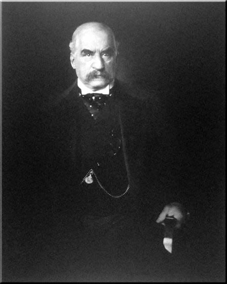

# Last Week's Strategy: The Anchoring Trap

---

## Quick Callback

::: {style="font-size: 1.6em; line-height: 1.8;"}
Last week's strategy: **The Anchoring Trap**

*First number wins.*

**Anyone try it?** Did you lead with an extreme number before offering your "reasonable" version?
:::

---

## Something You Took Away Last Week

::: {style="font-size: 1.5em; line-height: 1.8;"}
Week 5 showed you that **every building is a climate decision.**

The Urban Heat Island effect — concrete absorbs heat, cities get hotter, AC demand rises, more fossil fuels burn, cities get *even hotter.*

You saw it in NYC (one park = 5°C difference), Vienna (turning trash into heat for 60,000 homes), and LA (paying people to rip out their lawns).
:::

::: {style="font-size: 1.4em; margin-top: 30px; font-weight: bold; color: #8e44ad;"}
The built environment is a climate actor. But here's the question: **even if we know the right design, who decides what gets built?**
:::

---

## From Buildings → The Rules That Build Them

::: {style="font-size: 1.5em; line-height: 1.8;"}
Last week: *"What did we build, and what does it cost the planet?"*

This week: *"Why don't we build better — and whose fault is that?"*

**Same system. Bigger question.**

You can design the greenest building in the world, but if the economic incentives reward cheap construction and short-term profit, it won't get built. The problem isn't engineering — it's **structural incentives.**
:::

::: {style="font-size: 1.3em; margin-top: 25px; background: #f0f0f0; padding: 20px; border-radius: 10px;"}
Your toolkit: Spectacle Formula → Complexity → System Boundaries → Timing → Built Environment → **now: Structural Incentives.**
:::

---

## {background-color="#000000"}

::: {style="text-align: center;"}
{width="75%"}
:::

::: {style="font-size: 1.3em; text-align: center; color: #ccc; margin-top: 20px;"}
*No one decided to destroy the Amazon. Everyone just followed the incentives.*
:::

---

# This Week's Battlefield

---

## Two Sides. Two Economic Worldviews.

::: {style="display: flex; justify-content: space-around; margin-top: 50px;"}
::: {style="text-align: center; width: 45%; background: #27ae60; color: white; padding: 50px; border-radius: 15px;"}
::: {style="font-size: 2.5em; font-weight: bold;"}
PRO-CLIMATE
:::
::: {style="font-size: 1.3em; margin-top: 20px;"}
= System Change

= "Capitalism caused this crisis"
:::
:::

::: {style="text-align: center; width: 45%; background: #3498db; color: white; padding: 50px; border-radius: 15px;"}
::: {style="font-size: 2.5em; font-weight: bold;"}
PRO-DEVELOPMENT
:::
::: {style="font-size: 1.3em; margin-top: 20px;"}
= Market Solutions

= "Growth lifts all boats"
:::
:::
:::

---

## The Core Tension

::: {style="font-size: 1.6em; line-height: 1.8;"}
| PRO-CLIMATE | PRO-DEVELOPMENT |
|-------------|-----------------|
| System change needed | Reform within system |
| Degrowth / post-growth | Green growth |
| Collective ownership | Private innovation |
| Regulation & mandates | Market incentives |
| Present suffering | Future prosperity |

**This tension appears in every economic climate debate.**
:::

---

# From Energy to Capital

---

## The Oldest Energy Source

::: {style="font-size: 2.5em; text-align: center; padding: 60px; background: #1a1a2e; color: white; border-radius: 15px;"}
When was the earliest of all times that humans started to harvest energy?
:::

::: {style="font-size: 3em; text-align: center; margin-top: 40px; font-weight: bold; color: #e67e22;"}
Campfire.
:::

---

## {background-color="black"}

{width="85%"}

---

## From Campfire to Capital

::: {style="font-size: 1.5em; line-height: 1.8;"}
Energy at scale created **surplus.** Surplus created **exchange.** Exchange created **markets.** Markets created **capital.**

- 1st Industrial Revolution → coal, steam, factory
- 2nd Industrial Revolution → oil, electricity, mass production
- Energy surplus at scale → source, transportation, end-user, importer

[**The chain: energy → surplus → market → currency → capital.**]{style="color: #e74c3c; font-weight: bold;"}
:::

::: {style="font-size: 1.3em; margin-top: 20px; font-style: italic;"}
Energy issues don't arise in isolation — they arise at **scale.**
:::

---

## {background-color="#1a1a2e"}

::: {style="font-size: 2em; color: white; line-height: 1.6; font-style: italic;"}
"It is not from the benevolence of the butcher, the brewer, or the baker that we expect our dinner, but from their regard to their own interest."
:::

::: {style="font-size: 1.4em; color: #95a5a6; margin-top: 30px;"}
— Adam Smith, *The Wealth of Nations*, Book I, Chapter 2, 1776
:::

::: {style="font-size: 1.4em; color: #e67e22; margin-top: 20px; font-weight: bold;"}
Self-interest as engine. That's the promise of capitalism — and the root of its climate problem.
:::

---

## What Is Capital?

::: {style="font-size: 1.6em; line-height: 1.8; background: #ecf0f1; padding: 40px; border-radius: 15px;"}
The accumulated wealth of an individual, company, or community, used as a fund for carrying on fresh production.

**Wealth in any form used to help produce more wealth.**
:::

::: {style="font-size: 1.5em; margin-top: 30px; font-weight: bold; color: #e67e22;"}
And what is capitalism?
:::

::: {style="font-size: 1.3em; margin-top: 15px;"}
"Capitalism" and "Capitalist" are 19th-century pejoratives — names given by its enemies. But the system itself has two faces:

- **Enormous productive capacity**
- **Always on the edge of being out of control**
:::

---

## Who Is This Man?

::: {style="display: flex; gap: 40px;"}
::: {style="width: 40%;"}
{width="100%"}
:::
::: {style="width: 55%; font-size: 1.5em; line-height: 1.8;"}
- Does he look warm and fuzzy?
- What's he holding?

This is **J.P. Morgan** — the man who personally bailed out the US government. Twice.

Capitalism has always had a face. Usually holding a cigar.
:::
:::

---

## Capitalism Is... (Per Karl Marx)

::: {style="font-size: 1.5em; line-height: 1.8;"}
- A disease for which scientific socialism is the cure
- A method to steal the labour of the exploited masses
- *A system that undermines every traditionally established way of making a living*
- [A system that inevitably undermines its own foundations.]{style="color: #e74c3c; font-weight: bold;"}
:::

---

## Capitalism Is... (Per Current Definitions)

::: {style="font-size: 1.4em; line-height: 1.8;"}
A system defined by:

- **Private deployment of capital**
- **Open acknowledgement of profit as a motive**
- **Sympathetic understanding of self/household interests**
- **Tolerance for innovation** — though the characteristic fact of historical society is *resistance* to innovation as a kind of human nature
:::

::: {style="font-size: 1.3em; margin-top: 20px; font-style: italic;"}
Hundreds of variations exist, but the essentials remain unchanged.
:::

---

## Recommended Reading {.smaller}

::: {style="font-size: 1.2em; line-height: 1.6;"}
| Book | Author | Why It Matters |
|------|--------|----------------|
| *Wealth of Nations* | Adam Smith | The founding text |
| *The Communist Manifesto* | Karl Marx | The founding critique |
| *The Constitution of Liberty* | Friedrich Hayek | The market conservative response |
| *A Farewell to Alms* | Gregory Clark | Capitalism: more and better? |
| *The Mystery of Capital* | Hernando de Soto | Why property rights precede development |
| *A Failure of Capitalism* | Richard Posner | A conservative judge's honest assessment |
| *The Bottom Billion* | Paul Collier | Capital development to alleviate poverty |
| *The White Tiger* | Aravind Adiga | A poor, smart, flawed man in South India. Man Booker Prize, 2008. |
:::

---

# Climate Change Meets Capitalism

---

## The Vocabulary You Need

::: {style="font-size: 1.3em; line-height: 1.8;"}
| Concept | Thinker | Core Idea |
|---------|---------|-----------|
| **Capitalist Realism** | Fredric Jameson | Capitalism is the only viable system; alternatives are unimaginable |
| **Disaster Capitalism** | Naomi Klein | Exploitation of crises for profit |
| **Surveillance Capitalism** | Shoshana Zuboff | Using technology to monitor and control for profit |
| **Zero Marginal Cost Society** | Jeremy Rifkin | Technology makes goods virtually free → post-scarcity |
| **Green New Deal** | Various | Transition to carbon-neutral while promoting social justice |
:::

---

## The Tragedy of the Commons

::: {style="font-size: 1.6em; line-height: 1.8;"}
When individuals prioritise their own interests over common goods, the commons collapses.

This applies to:

- **Individuals** — driving, flying, consuming
- **Corporations** — externalising pollution costs
- **Nations** — free-riding on others' emission cuts
:::

::: {style="font-size: 1.4em; margin-top: 20px; font-weight: bold; color: #c0392b;"}
A new economic system may help. But how?
:::

---

## {background-color="#1a1a2e"}

::: {style="font-size: 2em; color: white; line-height: 1.6; font-style: italic;"}
"Ruin is the destination toward which all men rush, each pursuing his own best interest in a society that believes in the freedom of the commons."
:::

::: {style="font-size: 1.4em; color: #95a5a6; margin-top: 30px;"}
— Garrett Hardin, "The Tragedy of the Commons", *Science*, Vol. 162, 1968
:::

---

## See It: The Pattern That Keeps Repeating



::: {style="font-size: 1.1em; margin-top: 10px; color: #7f8c8d; text-align: center;"}
*TED-Ed (~5 min). The Tragedy of the Commons — from medieval grazing to climate collapse. The twist: communal management often works better than privatisation.*
:::

---

## One Image. One Question.

::: {style="font-size: 2.5em; text-align: center; padding: 60px; background: #1a1a2e; color: white; border-radius: 15px; line-height: 1.6;"}
BP invented the concept of a **"personal carbon footprint"** in 2005.

It was an ad campaign.

[**You were the product.**]{style="color: #e74c3c;"}
:::

::: {style="font-size: 1.5em; text-align: center; margin-top: 30px;"}
Structural problems require structural solutions. Individual guilt is a distraction.
:::

---

## {background-color="#1a1a2e"}

::: {style="font-size: 2em; color: white; line-height: 1.6; font-style: italic;"}
"It is difficult to get a man to understand something, when his salary depends upon his not understanding it."
:::

::: {style="font-size: 1.4em; color: #95a5a6; margin-top: 30px;"}
— Upton Sinclair, *I, Candidate for Governor: And How I Got Licked*, 1935, p. 109
:::

::: {style="font-size: 1.4em; color: #e74c3c; margin-top: 20px; font-weight: bold;"}
This is why oil executives don't "believe in" climate change. They understand it fine. They're paid not to.
:::

---

## Carbon Pricing: Pay to Pollute?

::: {style="font-size: 1.5em; line-height: 1.8;"}
The usual market solution to climate change: **price the pollution.**

| Mechanism | How It Works | The Problem |
|-----------|-------------|-------------|
| **Carbon Tax** | Fixed price per tonne of CO₂ | Who sets the price? |
| **Carbon Credit** | Right to emit, tradeable | Government selling right to pollute? |
| **Carbon Offset** | Pay someone else to reduce | Does it actually reduce anything? |
:::

::: {style="font-size: 1.3em; margin-top: 20px; font-style: italic;"}
What happens when the price target moves? When carbon becomes a commodity to trade *for profit*?
:::

---

# What If Growth Isn't the Answer?

---

## {background-color="black"}

{width="75%"}

---

## The Post-Growth Challenge

::: {style="font-size: 1.5em; line-height: 1.8;"}
A continued growth mindset is unsustainable. But what replaces it?
:::

::: {style="display: flex; justify-content: space-around; margin-top: 30px;"}
::: {style="text-align: left; width: 45%; background: #27ae60; color: white; padding: 30px; border-radius: 10px;"}
::: {style="font-size: 1.4em; font-weight: bold;"}
Alternative Models
:::
::: {style="font-size: 1.2em; line-height: 1.6; margin-top: 15px;"}
- **Bhutan** — Gross National Happiness Index: well-being, conservation, cultural preservation
- **New Zealand** — Wellbeing Budget: mental health, child poverty, environment over GDP
- **Nordic Model** — free market + comprehensive welfare + collective bargaining
:::
:::

::: {style="text-align: left; width: 45%; background: #3498db; color: white; padding: 30px; border-radius: 10px;"}
::: {style="font-size: 1.4em; font-weight: bold;"}
Collective Ownership
:::
::: {style="font-size: 1.2em; line-height: 1.6; margin-top: 15px;"}
- **Mondragon** (Spain) — largest worker cooperative; workers own and operate
- **Community Land Trusts** (Boston, London) — nonprofit collective land ownership for affordable housing
- **Germany** — social market economy: free enterprise + social welfare + environmental protection
:::
:::
:::

---

## {background-color="black"}

{width="85%"}

---

## Mixed Economy: The Singapore Question

::: {style="font-size: 1.5em; line-height: 1.8;"}
**Singapore's blend:** competitive open markets + strong state intervention in housing, healthcare, and public transport.

**Germany's blend:** capitalist economy + framework of social policies balancing enterprise with welfare and environmental protection.
:::

::: {style="font-size: 1.4em; margin-top: 20px; background: #f39c12; padding: 20px; border-radius: 10px;"}
The question isn't capitalism vs. socialism. It's: **what mix — and who decides?**
:::

# Building Your Economic Spectacle

---

## The Formula (Reminder)

::: {style="font-size: 1.8em; line-height: 1.8;"}
**Fact** + **Human Story** + **Stakes** = **Spectacle**
:::

::: {style="display: flex; justify-content: space-around; margin-top: 50px;"}
::: {style="text-align: center; width: 30%; background: #ecf0f1; padding: 30px; border-radius: 10px;"}
::: {style="font-size: 1.2em; font-weight: bold;"}
Weak
:::
"Capitalism causes emissions"
:::

::: {style="text-align: center; width: 30%; background: #f39c12; color: white; padding: 30px; border-radius: 10px;"}
::: {style="font-size: 1.2em; font-weight: bold;"}
Better
:::
"100 companies produce 71% of global emissions"
:::

::: {style="text-align: center; width: 30%; background: #e74c3c; color: white; padding: 30px; border-radius: 10px;"}
::: {style="font-size: 1.2em; font-weight: bold;"}
Spectacle
:::
"While you recycle, Shell knew about climate change in 1988 and spent millions denying it"
:::
:::

---

## PRO-CLIMATE: Make It Personal

::: {style="background: #27ae60; color: white; padding: 40px; border-radius: 15px; font-size: 1.5em; line-height: 1.8;"}
**Don't say:** "Carbon pricing has limitations."

**Say:** "They want you to pay more for petrol while ExxonMobil gets tax breaks. You're being charged for their mess."

**Don't say:** "We need systemic change."

**Say:** "Your grandfather could afford a house on one salary. You can't afford rent on two. That's not laziness — that's a system extracting everything from you."
:::

---

## PRO-DEVELOPMENT: Paint the Picture

::: {style="background: #3498db; color: white; padding: 40px; border-radius: 15px; font-size: 1.5em; line-height: 1.8;"}
**Don't say:** "Markets drive innovation."

**Say:** "In 2010, solar cost $378/MWh. Today: $36. That's not government mandates — that's competition. Capitalism did that."

**Don't say:** "We need economic growth."

**Say:** "My grandmother grew up without electricity in rural China. Capitalism gave her grandchildren air conditioning, smartphones, and choices. Don't take that away in the name of the planet."
:::

---

## What If the New Model Is Wrong?

::: {style="font-size: 1.4em; line-height: 1.8;"}
Think Tesla. [*(If you have to.)*]{style="color: #e67e22;"}

What happens if we switch to a new economic model and it fails?

| Risk | What Goes Wrong |
|------|----------------|
| **Economic Slowdown** | Growth stalls, jobs disappear |
| **Investment Displacement** | Capital moves to the wrong sectors |
| **Innovation Misdirection** | We solve the wrong problem (e.g. biofuels → deforestation) |
| **Cost of Living** | Carbon tax reflected in daily expenses |
| **Inequality** | Transition costs fall on those who can't afford them |
:::

::: {style="font-size: 1.3em; margin-top: 20px; font-style: italic;"}
The risk of changing is real. But so is the risk of not changing.
:::

---

## Your Cheatsheet: PRO-CLIMATE {.smaller}

::: {style="font-size: 1.3em; line-height: 1.8;"}
**Arguments for a Resilient HK Economy:**

- **Green tech startups** — foster a competitive market for renewable energy
- **Circular economy models** — test sustainable business practices in HK
- **Public-private partnerships** — leverage private capital for smart city initiatives
- **Progressive regulation** — environmental rules that encourage (not punish) innovation
- **Carbon pricing** — incentivise low-carbon operations
- **Community-led initiatives** — public awareness + local sustainability projects
:::

---

## Your Cheatsheet: PRO-DEVELOPMENT {.smaller}

::: {style="font-size: 1.3em; line-height: 1.8;"}
**Arguments for HK's Economic Stability:**

- **Growth first** — maintain a business-friendly environment, ensure job security
- **Proven strategies only** — avoid untested models that risk market disruption
- **Minimal regulation** — voluntary corporate sustainability, not mandates
- **Cost-benefit analysis** — evaluate green initiatives on ROI, protect SMEs
- **Incremental improvements** — gradual energy efficiency gains, low-risk green projects
:::

---

## This Week's Debate Motion

::: {style="font-size: 2em; text-align: center; background: #2c3e50; color: white; padding: 50px; border-radius: 15px;"}
**"This house believes that Hong Kong should impose a mandatory carbon tax on all businesses to fund its 2050 carbon neutrality target."**
:::

::: {style="font-size: 1.3em; margin-top: 30px; text-align: center;"}
PRO-CLIMATE: Make polluters pay — structural change requires structural funding.

PRO-DEVELOPMENT: A carbon tax will kill HK's competitiveness — innovation, not taxation, drives change.
:::

---

# Activity: Economic Futures Debate

---

## Create Your Persona

:::: {.columns}
::: {.column width="48%"}
::: {style="background: #e8f5e9; padding: 20px; border-radius: 10px; font-size: 1.1em;"}
**Lean PRO-CLIMATE?** Try being a...

- Labour union organiser fighting for just transition
- Economist advocating degrowth
- Community activist in a polluted industrial zone
- Youth climate striker
:::
:::
::: {.column width="4%"}
:::
::: {.column width="48%"}
::: {style="background: #e3f2fd; padding: 20px; border-radius: 10px; font-size: 1.1em;"}
**Lean PRO-DEVELOPMENT?** Try being a...

- Hong Kong business owner worried about regulations
- Developing-nation finance minister
- Tech entrepreneur building "green" startups
- Traditional economist focused on GDP growth
:::
:::
::::

::: {style="font-size: 1.3em; font-style: italic; margin-top: 25px; text-align: center;"}
Ask yourself: **What do I stand to lose?** That's where your story begins.
:::

---

## Remember: Fact-Check Your Stories

::: {style="font-size: 2.5em; font-weight: bold; color: #c0392b; text-align: center;"}
Every story must be **fact-checkable**.
:::

::: {style="display: flex; justify-content: space-around; margin-top: 30px;"}
::: {style="text-align: left; width: 45%; background: #27ae60; color: white; padding: 30px; border-radius: 10px;"}
::: {style="font-size: 1.5em; font-weight: bold;"}
OK to Say
:::
::: {style="font-size: 1.2em; line-height: 1.6; margin-top: 15px;"}
- "Shell knew about climate change in 1988" *(documented)*
- "Solar costs dropped 89% since 2010" *(IEA data)*
- "Bhutan measures Gross National Happiness" *(policy fact)*
:::
:::

::: {style="text-align: left; width: 45%; background: #e74c3c; color: white; padding: 30px; border-radius: 10px;"}
::: {style="font-size: 1.5em; font-weight: bold;"}
NOT OK
:::
::: {style="font-size: 1.2em; line-height: 1.6; margin-top: 15px;"}
- "Capitalism has killed millions" *(vague, unverifiable)*
- "Green policies destroy all jobs" *(exaggeration)*
- "Degrowth will solve everything" *(unfounded claim)*
:::
:::
:::

---

## Human Story: The Shenzhen Factory Worker

::: {style="font-size: 1.4em; line-height: 1.8;"}
**Mei Li** worked 12-hour shifts making electronics for $400/month. Her factory was shut down for "environmental violations."

**PRO-CLIMATE says:** "Finally! That factory was poisoning the river. Workers like Mei deserve clean air."

**PRO-DEVELOPMENT says:** "Mei lost her job. Her family went hungry. Now she begs on the street. Was the clean river worth it?"

**The real question:** How do we transition without leaving Mei behind?
:::

::: {style="font-size: 1.3em; margin-top: 30px; color: #7f8c8d;"}
*Both narratives are emotionally powerful. Both are incomplete. Your job: Find the fuller story.*
:::

---

#

```{=html}
<style>
  #w6groupAssignment_container {
    text-align: center;
    margin-top: 20px;
    font-family: Arial, sans-serif;
  }
  #w6groupAssignment_startButton {
    font-size: 24px;
    padding: 15px 30px;
    cursor: pointer;
    background-color: #3498db;
    color: white;
    border: none;
    border-radius: 5px;
    transition: background-color 0.3s;
  }
  #w6groupAssignment_startButton:hover {
    background-color: #2980b9;
  }
  #w6groupAssignment_overlay {
    position: fixed;
    top: 0;
    left: 0;
    width: 100%;
    height: 100%;
    background-color: rgba(255, 255, 255, 0.9);
    display: none;
    justify-content: center;
    align-items: center;
    z-index: 1000;
  }
  #w6groupAssignment_display {
    font-size: 36px;
    text-align: center;
    padding: 20px;
    max-width: 90%;
    max-height: 90%;
    overflow-y: auto;
  }
  #w6groupAssignment_display h2 {
    color: #2c3e50;
    font-size: 48px;
    margin-bottom: 30px;
  }
  #w6groupAssignment_display ul {
    list-style-type: none;
    padding: 0;
  }
  #w6groupAssignment_display li {
    margin: 20px 0;
    font-size: 36px;
    background-color: #ecf0f1;
    padding: 15px;
    border-radius: 10px;
    box-shadow: 0 2px 5px rgba(0,0,0,0.1);
  }
  #w6groupAssignment_closeButton {
    position: absolute;
    top: 20px;
    right: 20px;
    font-size: 24px;
    cursor: pointer;
    background-color: #e74c3c;
    color: white;
    border: none;
    border-radius: 5px;
    padding: 10px 20px;
  }
</style>

<div id="w6groupAssignment_container">
  <h1 style="font-size: 48px; color: #34495e;">Group Assignment Time!</h1>
  <button id="w6groupAssignment_startButton">Start the assignment</button>
</div>

<div id="w6groupAssignment_overlay">
  <div id="w6groupAssignment_display"></div>
  <button id="w6groupAssignment_closeButton">Close</button>
</div>

<script>
const W6GroupAssignment = {
  groups: [
    'Group One', 'Group Two', 'Group Three', 'Group Four',
    'Group Five', 'Group Six'
  ],
  vocations: [
    'Finance/Banking',
    'Labour/Workers\' Rights',
    'Policy/Government',
    'Small Business/Entrepreneurs',
    'Environmental Advocacy',
    'Consumer/General Public'
  ],

  shuffleArray: function(array) {
    for (let i = array.length - 1; i > 0; i--) {
      const j = Math.floor(Math.random() * (i + 1));
      [array[i], array[j]] = [array[j], array[i]];
    }
    return array;
  },

  createAssignment: function() {
    const shuffledVocations = this.shuffleArray([...this.vocations]);
    return this.groups.map((group, index) => ({
      group: group,
      vocation: shuffledVocations[index]
    }));
  },

  displayAssignment: function() {
    const assignments = this.createAssignment();
    let html = '<h2>Random Group Assignments</h2><ul>';
    assignments.forEach(assignment => {
      html += `<li><strong>${assignment.group}:</strong> ${assignment.vocation}</li>`;
    });
    html += '</ul>';
    document.getElementById('w6groupAssignment_display').innerHTML = html;
    document.getElementById('w6groupAssignment_overlay').style.display = 'flex';
  },

  init: function() {
    const startButton = document.getElementById('w6groupAssignment_startButton');
    const closeButton = document.getElementById('w6groupAssignment_closeButton');
    startButton.addEventListener('click', () => this.displayAssignment());
    closeButton.addEventListener('click', () => {
      document.getElementById('w6groupAssignment_overlay').style.display = 'none';
    });
  }
};
W6GroupAssignment.init();
</script>
```

## Presentation Countdown

<div id="w6timer-container" style="text-align: center;">
  <div id="w6timer" style="
    font-size: 348px;
    color: black;
    margin-bottom: 20px;">00:00</div>
  <button id="w6start-button" style="
    font-size: 24px;
    padding: 15px 30px;
    cursor: pointer;
    background-color: #27ae60;
    color: white;
    border: none;
    border-radius: 8px;" onclick="w6startTimer()">Start 5:00</button>
  <button id="w6reset-button" style="
    font-size: 24px;
    padding: 15px 30px;
    cursor: pointer;
    background-color: #e74c3c;
    color: white;
    border: none;
    border-radius: 8px;
    margin-left: 10px;" onclick="w6resetTimer()">Reset</button>
</div>

<script>
let w6timeLeft = 300;
let w6timerInterval = null;

function w6updateDisplay() {
  const minutes = Math.floor(w6timeLeft / 60);
  const seconds = w6timeLeft % 60;
  document.getElementById('w6timer').textContent =
    String(minutes).padStart(2, '0') + ':' + String(seconds).padStart(2, '0');
  if (w6timeLeft <= 30) {
    document.getElementById('w6timer').style.color = '#e74c3c';
  } else {
    document.getElementById('w6timer').style.color = 'black';
  }
}

function w6startTimer() {
  if (w6timerInterval) return;
  w6timerInterval = setInterval(() => {
    if (w6timeLeft > 0) {
      w6timeLeft--;
      w6updateDisplay();
    } else {
      clearInterval(w6timerInterval);
      w6timerInterval = null;
    }
  }, 1000);
}

function w6resetTimer() {
  clearInterval(w6timerInterval);
  w6timerInterval = null;
  w6timeLeft = 300;
  w6updateDisplay();
}

w6updateDisplay();
</script>

---

# The Persuasion Playbook | Strategy #5

---

## The Specificity Illusion

::: {style="font-size: 1.6em; background: #2c3e50; color: white; padding: 40px; border-radius: 10px;"}
Which is more believable?

A: *"The project will take a few weeks."*

B: *"The project will take 17 days."*

**B. Always B.** Even if both are equally made up.
:::

---

## The Science

::: {style="font-size: 1.4em; line-height: 1.8;"}
This is the **Specificity Heuristic**.

The brain uses detail as a proxy for credibility. Specific = precise = probably measured = probably true.

Con artists and skilled liars know this: add irrelevant detail and people stop questioning.

*"I was at the corner of 5th and Main at 3:47pm"* beats *"I was downtown that afternoon."*
:::

---

## You Just Saw It

::: {style="font-size: 1.6em; line-height: 1.8;"}
Arguments that landed today had **unnecessary precision**:

- Not "lots of energy" → "415 TWh"
- Not "many people" → "240 million people"
- Not "recently" → "March 2024"

The detail signals: *I didn't make this up.*
:::

---

## Next Week's Challenge

::: {style="font-size: 2em; background: #e74c3c; color: white; padding: 40px; border-radius: 10px; text-align: center;"}
**Replace every vague word with a specific number, date, or name.**

Even if no one checks — they'll believe you more.
:::
