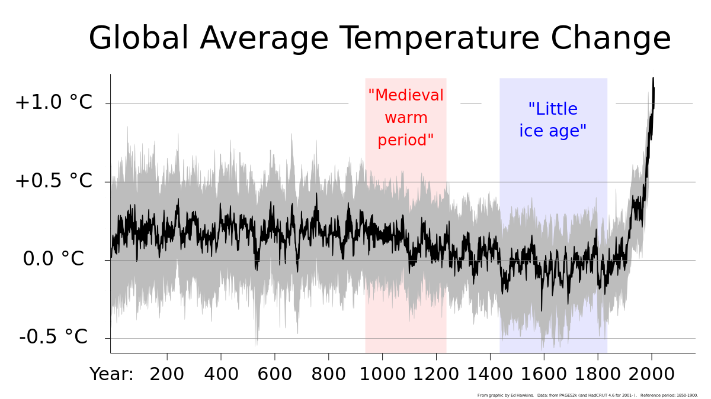

# Last Week's Strategy: The Specificity Illusion

---

## Quick Callback

::: {style="font-size: 1.6em; line-height: 1.8;"}
Last week's strategy: **The Specificity Illusion**

*Detail = credibility.*

**Anyone try it?** Did you replace vague words with specific numbers, dates, or names?
:::

---

## Something You Took Away Last Week

::: {style="font-size: 1.5em; line-height: 1.8;"}
Week 6 gave you a name for the problem: **the Tragedy of the Commons.**

Individual action can't fix structural problems. Carbon pricing, cap-and-trade, green taxes — these are attempts to *redesign the incentives* so the system stops rewarding destruction.

But you also saw that even well-designed policies get blocked — by politics, by money, by power.
:::

::: {style="font-size: 1.4em; margin-top: 30px; font-weight: bold; color: #8e44ad;"}
So what happens when even the **truth itself** becomes a product?
:::

---

## Quick W6 Recap: The Structural Trap

::: {style="font-size: 1.4em; line-height: 1.8;"}
Three things from last week you need to hold onto:

**1. The Tragedy of the Commons** — everyone acts rationally, the commons collapses anyway.

**2. BP's carbon footprint** — the oil industry invented "personal responsibility" as a deflection strategy. You were the product.

**3. The Upton Sinclair principle** — *"It is difficult to get a man to understand something, when his salary depends upon his not understanding it."*
:::

::: {style="font-size: 1.5em; margin-top: 25px; font-weight: bold; color: #c0392b;"}
Now: what happens when the structure doesn't just incentivise destruction — but actively **manufactures doubt** about whether destruction is even happening?
:::

---

## From Structural Incentives → Manufactured Doubt

::: {style="font-size: 1.5em; line-height: 1.8;"}
Last week: *"Why don't we build better, and whose fault is that?"*

This week: *"What if people disagree on whether there's even a problem?"*

**The ultimate structural defence: make the truth itself debatable.**

Climate denial, historical revisionism, manufactured uncertainty — these aren't just "misinformation." They're **strategic tools** deployed to protect structural incentives.
:::

::: {style="font-size: 1.3em; margin-top: 25px; background: #f0f0f0; padding: 20px; border-radius: 10px;"}
Your toolkit: Spectacle Formula → Complexity → System Boundaries → Timing → Built Environment → Structural Incentives → **now: The Doubt Machine.**
:::

---

## Coming Up: Week 8 Preview

::: {style="font-size: 1.5em; line-height: 1.8; background: #0a3d62; color: white; padding: 40px; border-radius: 15px;"}
Next week, we go underwater.

The ocean covers **71%** of the planet. It absorbs **30%** of our CO₂. It traps **90%** of excess heat.

And we've explored less than **20%** of it.

Once you see how doubt is manufactured this week, you'll understand why an entire planet-scale system can hide in plain sight.
:::

---

## {background-color="#000000"}

::: {style="text-align: center;"}
{width="80%"}
:::

::: {style="font-size: 1.3em; text-align: center; color: #ccc; margin-top: 20px;"}
*They knew. They lied. The graph proves it.*
:::

---

# This Week's Battlefield

---

## Two Sides. Two Views on Truth.

::: {style="display: flex; justify-content: space-around; margin-top: 50px;"}
::: {style="text-align: center; width: 45%; background: #27ae60; color: white; padding: 50px; border-radius: 15px;"}
::: {style="font-size: 2.5em; font-weight: bold;"}
PRO-CLIMATE
:::
::: {style="font-size: 1.3em; margin-top: 20px;"}
= Scientific Consensus Matters

= "Denialism is dangerous"
:::
:::

::: {style="text-align: center; width: 45%; background: #3498db; color: white; padding: 50px; border-radius: 15px;"}
::: {style="font-size: 2.5em; font-weight: bold;"}
PRO-DEVELOPMENT
:::
::: {style="font-size: 1.3em; margin-top: 20px;"}
= Question Everything

= "Skepticism is healthy"
:::
:::
:::

---

## The Core Tension

::: {style="font-size: 1.6em; line-height: 1.8;"}
| PRO-CLIMATE | PRO-DEVELOPMENT |
|-------------|-----------------|
| Trust the science | Question the models |
| Expert consensus | Healthy skepticism |
| Urgency requires action | Uncertainty requires caution |
| Denialism is funded | Alarmism is funded too |
| Facts over feelings | Predictions often fail |

**This tension defines debates about truth, expertise, and action.**
:::

---

# The Doubt Machine

---

## {background-color="#1a1a2e"}

::: {style="font-size: 2.5em; color: white; text-align: center; line-height: 1.6;"}
*"Doubt is our product."*
:::

::: {style="font-size: 1.4em; color: #95a5a6; margin-top: 30px; text-align: center;"}
— Internal memo, Brown & Williamson Tobacco, 1969
:::

::: {style="font-size: 1.5em; color: #e74c3c; margin-top: 30px; text-align: center; font-weight: bold;"}
This one sentence built a $50 billion industry of denial — first for tobacco, then for fossil fuels.
:::

---

## The Playbook: Tobacco → Oil

::: {style="font-size: 1.4em; line-height: 2.0;"}
**Step 1:** Fund scientists to produce "alternative" research

**Step 2:** Amplify the 3% of dissenters, ignore the 97% consensus

**Step 3:** Reframe the debate — *"the science isn't settled"*

**Step 4:** Attack individual scientists, not their findings

**Step 5:** Shift blame to consumers — *"it's your personal choice"*
:::

::: {style="font-size: 1.5em; margin-top: 20px; background: #e74c3c; color: white; padding: 20px; border-radius: 10px; text-align: center;"}
**Same PR firms. Same strategy. Same result: decades of delay.**
:::

---

## One Timeline. One Cover-Up.

::: {style="font-size: 1.8em; line-height: 2.2; background: #1a1a2e; color: white; padding: 50px; border-radius: 15px;"}
[**1977**]{style="color: #3498db;"} — Exxon's own scientists warn: fossil fuels will warm the planet.

[**1989**]{style="color: #f39c12;"} — Exxon funds the Global Climate Coalition to manufacture doubt.

[**2023**]{style="color: #e74c3c;"} — Harvard study confirms: Exxon's 1977 projections were **remarkably accurate.**

They knew. They chose profit. [**You inherited the bill.**]{style="color: #e74c3c;"}
:::

---

## See It: Who Is Really Responsible?



::: {style="font-size: 1.1em; margin-top: 10px; color: #7f8c8d; text-align: center;"}
*Kurzgesagt (~10 min). The answer to "who is responsible?" changes completely depending on your metric — per-capita, annual, or cumulative. The narrative shapes the blame.*
:::

---

# Case Study 1: The Hockey Stick

---

## The Hockey Stick Graph


---

## What Does This Graph Actually Show?

::: {style="font-size: 1.5em; line-height: 1.8;"}
In 1998, climate scientist **Michael Mann** published a graph of global temperatures over the last **1,000 years.**

The shape tells the story:

- **The handle** (900–1900 AD): temperatures roughly flat — small ups and downs, no clear trend
- **The blade** (1900–present): a sharp, sudden spike upward

**The message:** for a thousand years, nothing much happened. Then we started burning fossil fuels — and the graph broke upward like a hockey stick.
:::

---

## Why It Mattered

::: {style="font-size: 1.5em; line-height: 1.8;"}
The Hockey Stick became the **icon of the IPCC's 2001 report** — the single most recognisable image in climate science.

It said, in one picture:

*"This is not natural variability. This is us."*

That made it **the most dangerous graph in the world** — for anyone whose profits depended on doubt.
:::

---

## The Attack

::: {style="font-size: 1.4em; line-height: 1.8;"}
**Who:** Steve McIntyre (retired mining executive) and Ross McKitrick (economist) — neither was a climate scientist.

**What they did:** Challenged Mann's statistical methods. Claimed the hockey-stick shape was an artefact of bad maths.

**The result:** Congressional hearings. Death threats to Mann. Op-eds in every major newspaper. *"The science isn't settled."*

**What they did NOT do:** Produce an alternative temperature reconstruction that showed a different story.
:::

---

## The Verdict

::: {style="font-size: 1.5em; line-height: 1.8;"}
Since 1998, **dozens of independent teams** using different data and different methods have reconstructed the temperature record.

**Every single one** confirms the basic shape: flat handle, sharp upward blade.

The National Academy of Sciences (2006) concluded:

*"The late 20th century warmth in the Northern Hemisphere was unprecedented during at least the last 1,000 years."*
:::

::: {style="font-size: 1.4em; margin-top: 20px; font-weight: bold; color: #c0392b;"}
The attack didn't disprove the science. It delayed the response by a decade.
:::

---

## {background-color="#2c3e50"}

::: {style="font-size: 1.8em; text-align: center; padding: 50px; color: white; line-height: 1.6;"}
You don't need to **win** the scientific debate.

You just need to make people **think there is one.**

That's how the Doubt Machine works.
:::

---

# Case Study 2: Climategate

---

## Climategate


---

## What Happened

::: {style="font-size: 1.4em; line-height: 1.8;"}
**November 2009** — weeks before the Copenhagen climate summit — hackers leaked **thousands of private emails** from the University of East Anglia's Climate Research Unit.

**The accusation:** Scientists were manipulating data and suppressing dissent.

**The most-quoted line:** Phil Jones wrote about using a "trick" to "hide the decline."

**What he actually meant:** A well-known statistical technique to handle a known data divergence in tree-ring records after 1960. "Trick" = clever method. Not deception.
:::

---

## The Verdict

::: {style="font-size: 1.5em; line-height: 1.8;"}
**Eight independent investigations** — UK Parliament, Penn State, the US EPA, and more.

**Result:** Scientists cleared of misconduct. Every. Single. Time.

**But the damage was done:**

- Public trust in climate science dropped **15 percentage points** in the year after
- The Copenhagen summit collapsed without a binding agreement
:::

::: {style="font-size: 1.4em; margin-top: 20px; font-weight: bold; color: #c0392b;"}
The emails were stolen. The quotes were cherry-picked. The scientists were cleared. And the world lost a decade.
:::

---

# Case Study 3: The Medieval Warm Period

---

## Medieval Warm Period



---

## The Argument

::: {style="font-size: 1.5em; line-height: 1.8;"}
**The claim:** From about **950–1250 AD**, parts of the North Atlantic were unusually warm. Vikings farmed in Greenland. Grapes grew in England.

**The sceptic's argument:** *"See? The climate has always changed. What's happening now is natural."*

**What they leave out:**

- The MWP was **regional** (mainly North Atlantic), not global
- Current warming is **global** and **faster** than anything in the record
- The *cause* matters — medieval warmth had natural drivers; current warming has an industrial one
:::

---

## {background-color="#1a1a2e"}

::: {style="font-size: 2.5em; color: white; text-align: center; line-height: 1.6;"}
The question isn't: *"Has the climate changed before?"*

Of course it has.

The question is: [**"Has it ever changed this fast — and did we cause it?"**]{style="color: #e74c3c;"}

The answer to both is **yes.**
:::

---

# Case Study 4: Fake News as a Weapon

---

## Trump's Climate Claims

::: {style="font-size: 1.4em; line-height: 1.8;"}
These aren't just "wrong." They're **the Doubt Machine operating at the highest level of political power.**

> *"The concept of global warming was created by and for the Chinese in order to make U.S. manufacturing non-competitive."*
> — Trump, Twitter, 2012

**Fact:** Climate science dates to the 1890s (Svante Arrhenius). It predates modern China by half a century.
:::

---

## More Claims, Same Playbook

::: {style="font-size: 1.4em; line-height: 1.8;"}
> *"It used to not be climate change, it used to be global warming… That wasn't working too well because it was getting too cold all over the place."*
> — Trump, Interview with Piers Morgan, 2018

**Fact:** Weather ≠ climate. The terminology shifted because "climate change" captures broader impacts — droughts, floods, storms. Not because warming stopped.

Global temperatures have risen consistently for decades.
:::

---

## The Sea Level Lie

::: {style="font-size: 1.4em; line-height: 1.8;"}
> *"The ocean is going to rise by 1/100th of an inch over 400 years. That's not our problem."*
> — Trump, Rally, December 2015

**Fact:** The IPCC projects **0.3–1.1 metres** of sea-level rise by 2100. That's enough to displace **hundreds of millions** of coastal residents.
:::

::: {style="font-size: 1.5em; margin-top: 20px; font-weight: bold; color: #c0392b;"}
Notice the pattern: minimise, confuse, redirect. The Doubt Machine doesn't need to be right. It just needs to sound plausible for long enough.
:::

---

# This Week's Conceptual Takeaway

---

## The Doubt Machine

::: {style="font-size: 1.6em; line-height: 1.8; background: #2c3e50; color: white; padding: 40px; border-radius: 15px;"}
Before this week, you might have thought climate denial was just ignorance — people who don't understand science.

Now you know: **doubt is a manufactured product.** It has a budget, a playbook, and a fifty-year track record.

- Tobacco → "smoking doesn't cause cancer"
- Fossil fuels → "the science isn't settled"
- Same firms, same strategy, same result: **delay**
:::

::: {style="font-size: 1.4em; margin-top: 30px; font-weight: bold; color: #8e44ad; text-align: center;"}
**Your portable takeaway:** Epistemic humility — when someone says "the science isn't settled," ask: *who profits from your uncertainty?*
:::

---

# Building Your Doubt Spectacle

---

## The Formula (Reminder)

::: {style="font-size: 1.8em; line-height: 1.8;"}
**Fact** + **Human Story** + **Stakes** = **Spectacle**
:::

::: {style="display: flex; justify-content: space-around; margin-top: 50px;"}
::: {style="text-align: center; width: 30%; background: #ecf0f1; padding: 30px; border-radius: 10px;"}
::: {style="font-size: 1.2em; font-weight: bold;"}
Weak
:::
"Misinformation is a problem"
:::

::: {style="text-align: center; width: 30%; background: #f39c12; color: white; padding: 30px; border-radius: 10px;"}
::: {style="font-size: 1.2em; font-weight: bold;"}
Better
:::
"Oil companies funded climate denial for 40 years"
:::

::: {style="text-align: center; width: 30%; background: #e74c3c; color: white; padding: 30px; border-radius: 10px;"}
::: {style="font-size: 1.2em; font-weight: bold;"}
Spectacle
:::
"ExxonMobil's own scientists predicted climate change in 1982. Then the company spent millions telling you it wasn't real. They knew. They lied. You paid."
:::
:::

---

## PRO-CLIMATE: Make It Personal

::: {style="background: #27ae60; color: white; padding: 40px; border-radius: 15px; font-size: 1.5em; line-height: 1.8;"}
**Don't say:** "Climate denial is funded by fossil fuel companies."

**Say:** "The same playbook. The same PR firms. Tobacco companies denied cancer for decades. Oil companies denied warming for decades. You were the mark both times."

**Don't say:** "Trust the scientific consensus."

**Say:** "97% of climate scientists agree. That's the same consensus level as 'smoking causes cancer.' You wouldn't bet your life on the 3%. Why bet your grandchildren's?"
:::

---

## PRO-DEVELOPMENT: Paint the Picture

::: {style="background: #3498db; color: white; padding: 40px; border-radius: 15px; font-size: 1.5em; line-height: 1.8;"}
**Don't say:** "Predictions have been wrong before."

**Say:** "In 1970, scientists predicted an ice age. In 1989, they said the Maldives would be underwater by 2018. The Maldives just opened 8 new luxury resorts. Excuse us for being sceptical."

**Don't say:** "Healthy scepticism is scientific."

**Say:** "They called Galileo a denier too. Science advances by questioning consensus, not by silencing dissent. Who's the real anti-science side?"
:::

---

## This Week's Debate Motion

::: {style="font-size: 1.8em; text-align: center; background: #2c3e50; color: white; padding: 50px; border-radius: 15px;"}
**"This house believes that fossil fuel companies that knowingly funded climate denial should be held legally liable for climate damages."**
:::

::: {style="font-size: 1.3em; margin-top: 30px; text-align: center;"}
PRO-CLIMATE: They knew. They lied. They should pay — just like Big Tobacco.

PRO-DEVELOPMENT: Legal liability will cripple the energy industry and raise costs for everyone. Punish the future for the past?
:::

---

# Activity: The Doubt Machine Debate

---

#

```{=html}
<style>
  #w7groupAssignment_container { text-align: center; margin-top: 20px; font-family: Arial, sans-serif; }
  #w7groupAssignment_startButton { font-size: 24px; padding: 15px 30px; cursor: pointer; background-color: #3498db; color: white; border: none; border-radius: 5px; transition: background-color 0.3s; }
  #w7groupAssignment_startButton:hover { background-color: #2980b9; }
  #w7groupAssignment_overlay { position: fixed; top: 0; left: 0; width: 100%; height: 100%; background-color: rgba(255,255,255,0.9); display: none; justify-content: center; align-items: center; z-index: 1000; }
  #w7groupAssignment_display { font-size: 36px; text-align: center; padding: 20px; max-width: 90%; max-height: 90%; overflow-y: auto; }
  #w7groupAssignment_display h2 { color: #2c3e50; font-size: 48px; margin-bottom: 30px; }
  #w7groupAssignment_display ul { list-style-type: none; padding: 0; }
  #w7groupAssignment_display li { margin: 20px 0; font-size: 36px; background-color: #ecf0f1; padding: 15px; border-radius: 10px; box-shadow: 0 2px 5px rgba(0,0,0,0.1); }
  #w7groupAssignment_closeButton { position: absolute; top: 20px; right: 20px; font-size: 24px; cursor: pointer; background-color: #e74c3c; color: white; border: none; border-radius: 5px; padding: 10px 20px; }
</style>
<div id="w7groupAssignment_container">
  <h1 style="font-size: 48px; color: #34495e;">Group Assignment Time!</h1>
  <button id="w7groupAssignment_startButton">Start the assignment</button>
</div>
<div id="w7groupAssignment_overlay">
  <div id="w7groupAssignment_display"></div>
  <button id="w7groupAssignment_closeButton">Close</button>
</div>
<script>
const W7GroupAssignment = {
  groups: ['Group One','Group Two','Group Three','Group Four','Group Five','Group Six'],
  vocations: ['Journalist/Media','Fossil Fuel Industry Rep','Climate Scientist','Policy Maker/Politician','Social Media Influencer','General Public/Student'],
  shuffleArray: function(a){for(let i=a.length-1;i>0;i--){const j=Math.floor(Math.random()*(i+1));[a[i],a[j]]=[a[j],a[i]];}return a;},
  createAssignment: function(){const s=this.shuffleArray([...this.vocations]);return this.groups.map((g,i)=>({group:g,vocation:s[i]}));},
  displayAssignment: function(){const a=this.createAssignment();let h='<h2>Random Group Assignments</h2><ul>';a.forEach(x=>{h+=`<li><strong>${x.group}:</strong> ${x.vocation}</li>`;});h+='</ul>';document.getElementById('w7groupAssignment_display').innerHTML=h;document.getElementById('w7groupAssignment_overlay').style.display='flex';},
  init: function(){document.getElementById('w7groupAssignment_startButton').addEventListener('click',()=>this.displayAssignment());document.getElementById('w7groupAssignment_closeButton').addEventListener('click',()=>{document.getElementById('w7groupAssignment_overlay').style.display='none';});}
};
W7GroupAssignment.init();
</script>
```

## Presentation Countdown

<div id="w7timer-container" style="text-align: center;">
  <div id="w7timer" style="font-size: 348px; color: black; margin-bottom: 20px;">05:00</div>
  <button id="w7start-button" style="font-size: 24px; padding: 15px 30px; cursor: pointer; background-color: #27ae60; color: white; border: none; border-radius: 8px;" onclick="w7startTimer()">Start 5:00</button>
  <button id="w7reset-button" style="font-size: 24px; padding: 15px 30px; cursor: pointer; background-color: #e74c3c; color: white; border: none; border-radius: 8px; margin-left: 10px;" onclick="w7resetTimer()">Reset</button>
</div>

<script>
let w7timeLeft = 300; let w7timerInterval = null;
function w7updateDisplay(){const m=Math.floor(w7timeLeft/60);const s=w7timeLeft%60;document.getElementById('w7timer').textContent=String(m).padStart(2,'0')+':'+String(s).padStart(2,'0');document.getElementById('w7timer').style.color=w7timeLeft<=30?'#e74c3c':'black';}
function w7startTimer(){if(w7timerInterval)return;w7timerInterval=setInterval(()=>{if(w7timeLeft>0){w7timeLeft--;w7updateDisplay();}else{clearInterval(w7timerInterval);w7timerInterval=null;}},1000);}
function w7resetTimer(){clearInterval(w7timerInterval);w7timerInterval=null;w7timeLeft=300;w7updateDisplay();}
w7updateDisplay();
</script>

---

## Group Discussion: Climate Truth Debate (10 min)

1. **Introductions**
   - Briefly introduce your persona
   - One sentence: how does manufactured doubt affect your persona?

2. **Round-table: Share Key Insights**
   - Identify one climate claim your persona encounters most often
   - Is it manufactured doubt, genuine uncertainty, or somewhere in between?

3. **Converse More**
   - Challenge another persona: is their "fact" a product of the Doubt Machine?
   - Find common ground — what can both sides agree is genuinely uncertain vs. deliberately manufactured?
   - Choose your champion!

---

# The Persuasion Playbook | Strategy #6

---

## The Pre-Mortem

::: {style="font-size: 1.6em; background: #2c3e50; color: white; padding: 40px; border-radius: 10px;"}
The CIA developed a technique:

Before launching an operation, assume it **failed catastrophically**.

Then ask: *"What went wrong?"*

**Teams using pre-mortems catch 30% more risks.**
:::

---

## The Science

::: {style="font-size: 1.4em; line-height: 1.8;"}
This is **Prospective Hindsight** (Mitchell et al., 1989).

Imagining failure as *already happened* unlocks different cognitive pathways than "what could go wrong?"

The brain is better at **explaining the past** than predicting the future.

So you trick it: treat the future as past.
:::

---

## You Just Saw It

::: {style="font-size: 1.6em; line-height: 1.8;"}
The teams that did well today **anticipated the counterattack**.

They didn't ask "what might they say?"

They assumed: *"We lost. Why?"*

Then they fixed it before it happened.
:::

---

## Next Week's Challenge

::: {style="font-size: 2em; background: #e74c3c; color: white; padding: 40px; border-radius: 10px; text-align: center;"}
**Before you present, assume it bombed.**

Write three reasons why. Fix them.
:::
