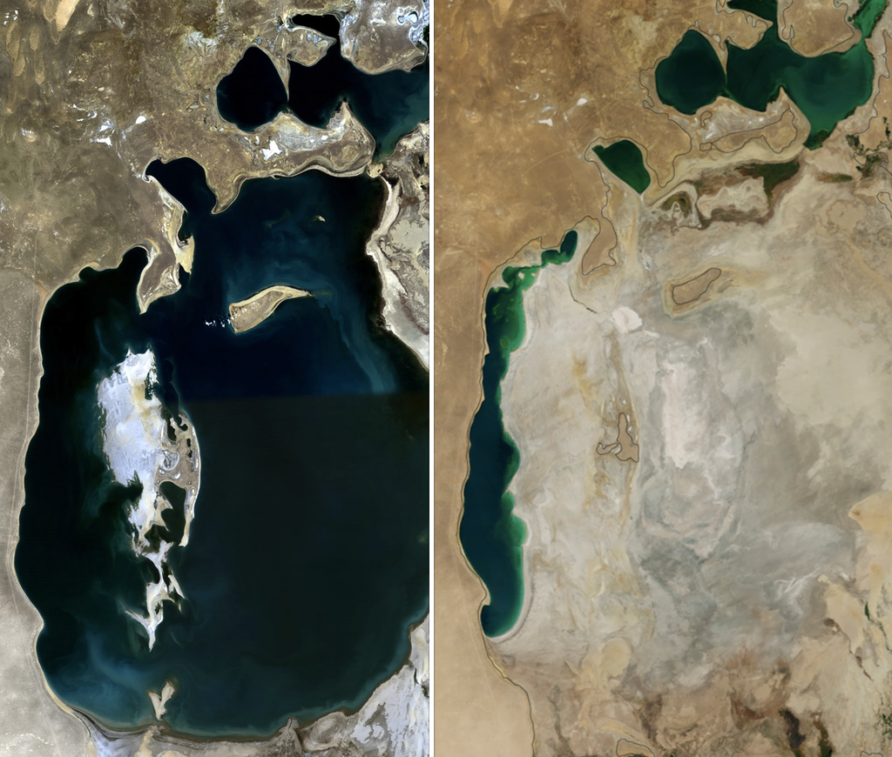
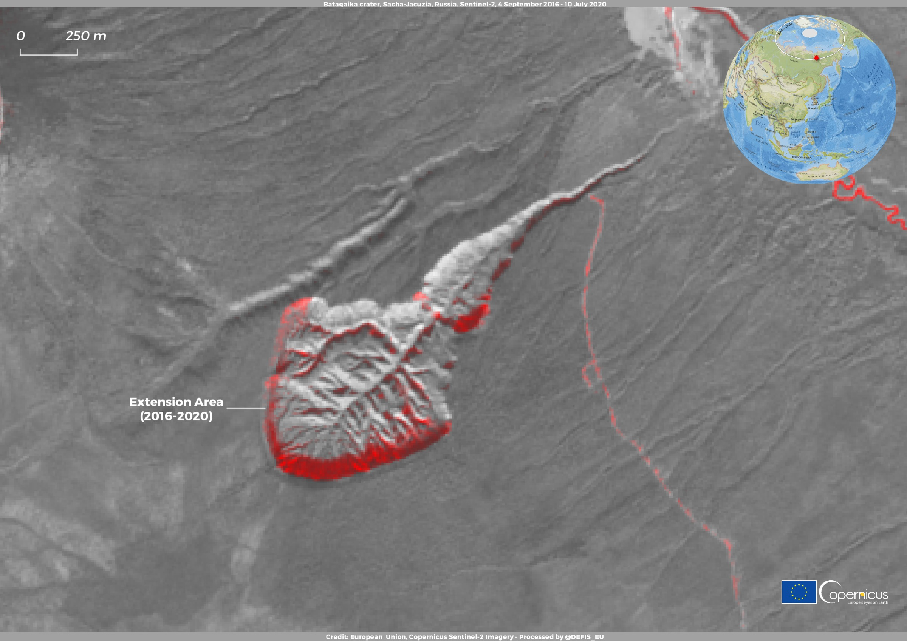
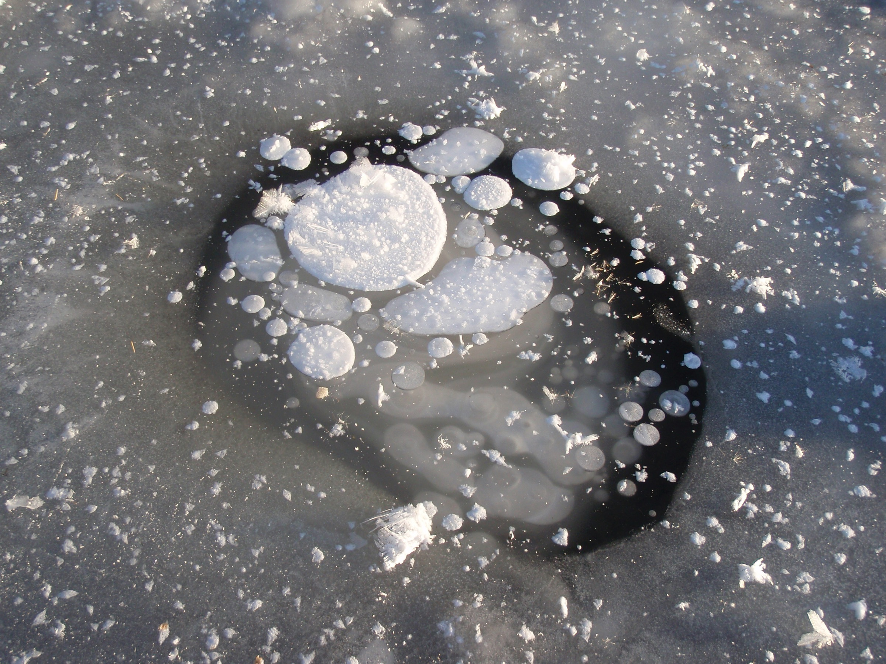
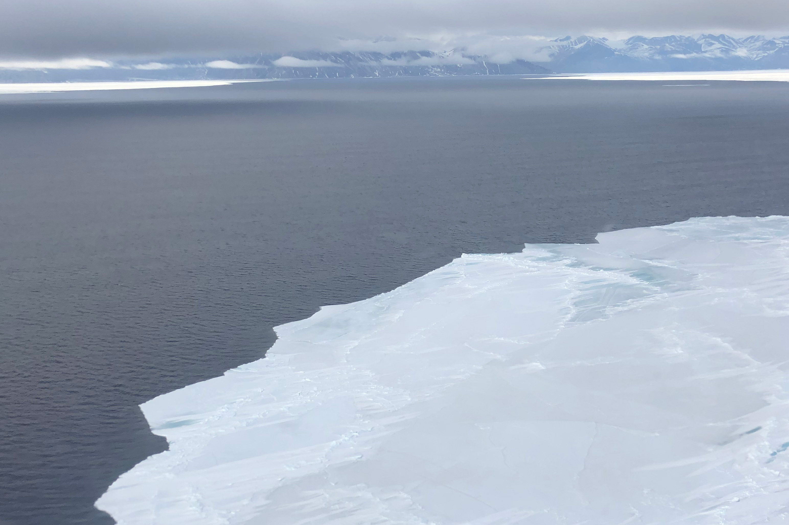
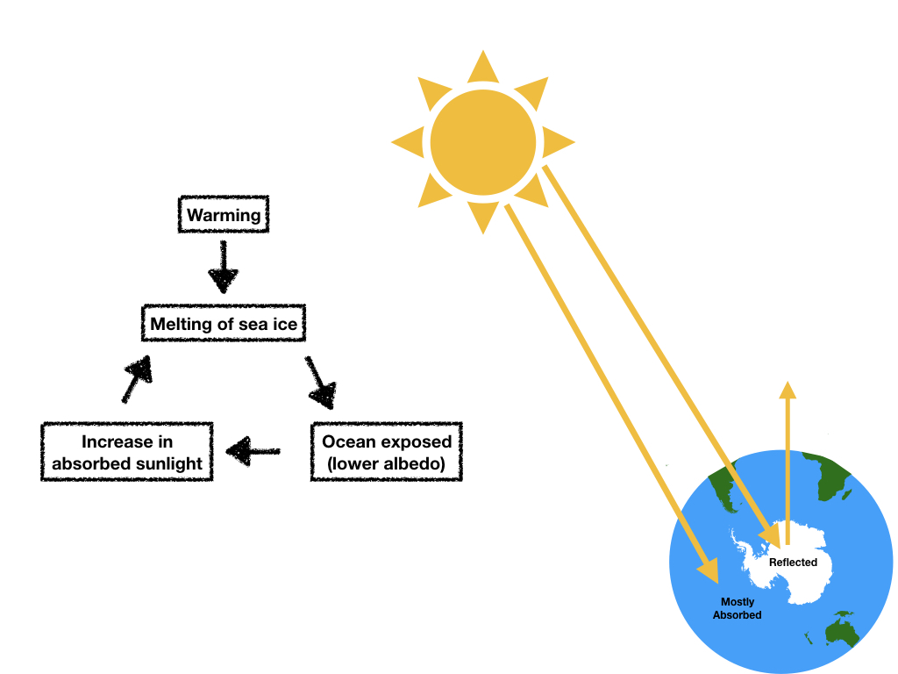
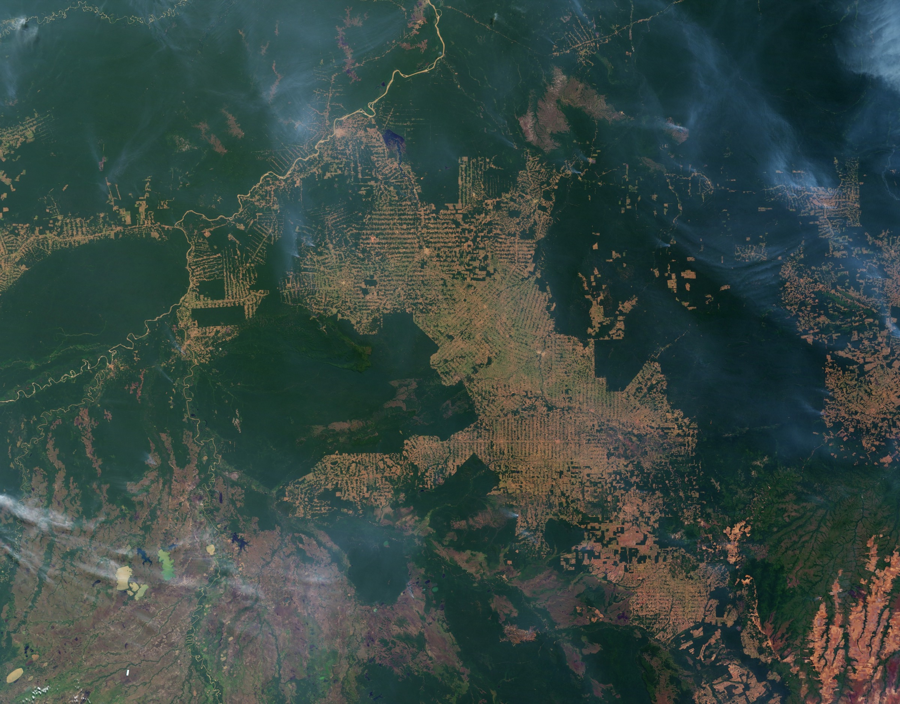
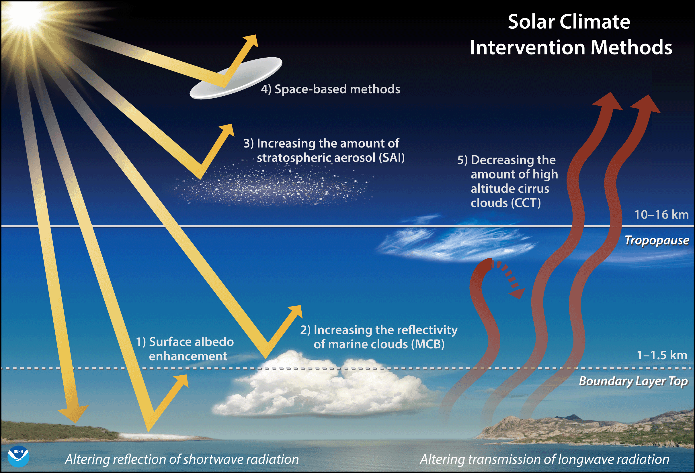

# Last Week's Strategy: The Invisible Bandwagon

---

## Quick Callback

::: {style="font-size: 1.6em; line-height: 1.8;"}
Last week's strategy: **The Invisible Bandwagon**

*You're the weird one if you don't.*

**Anyone try it?** Did you create a local, specific bandwagon for your argument?
:::

---

## Something You Took Away Last Week

::: {style="font-size: 1.5em; line-height: 1.8;"}
Week 9 showed you **responsibility asymmetry** — the cruel arithmetic of climate change.

The Carteret Islanders produce virtually zero carbon. They're losing their homes. 2,000 climate refugees arrive in Dhaka's slums every day. Venice gets a €5.5B flood barrier; Bangladesh gets sandbags.

And we asked: **are the people displaced by the Tai Po fire climate refugees?**
:::

::: {style="font-size: 1.4em; margin-top: 30px; font-weight: bold; color: #8e44ad;"}
Asymmetry means the system is entangled. Pull one thread, **everything moves.**
:::

---

## Quick W9 Recap: Responsibility Asymmetry

::: {style="font-size: 1.4em; line-height: 1.8;"}
Three things from last week you need to hold onto:

**1. The sponge model fails** — absorbing refugees without integrating them creates permanent dependency (Dhaka proves it). Relocation without livelihood is warehousing.

**2. System boundaries determine the answer** — draw the line around the refugee = shelter problem. Draw it around the system = responsibility problem. Where you draw it changes everything.

**3. Refugees can be resources** — HK was built by post-1949 refugees. But the conditions matter, the policy matters, and none of the models is a clean success story.
:::

::: {style="font-size: 1.5em; margin-top: 25px; font-weight: bold; color: #c0392b;"}
Now: what happens when the system itself starts to cascade?
:::

---

## From Who Suffers → How Everything Connects

::: {style="font-size: 1.5em; line-height: 1.8;"}
Last week: *"The people who suffer aren't the ones who caused it."*

This week: *"Everything is connected — and some connections are irreversible."*

**Cascade effects and tipping points.**

Wolves change rivers. Permafrost melts into methane. One feedback loop triggers another. Systems thinking isn't abstract — it's survival-critical.
:::

::: {style="font-size: 1.3em; margin-top: 25px; background: #f0f0f0; padding: 20px; border-radius: 10px;"}
Your toolkit: Spectacle Formula → Complexity → System Boundaries → Timing → Built Environment → Structural Incentives → The Doubt Machine → Invisible Infrastructure → Responsibility Asymmetry → **now: Cascade Effects.**
:::

---

## Coming Up: Week 11 Preview

::: {style="font-size: 1.5em; line-height: 1.8; background: #2c3e50; color: white; padding: 40px; border-radius: 15px;"}
Next week is the last. We zoom out — all the way out.

**The Overview Effect:** astronauts who see Earth from space report a cognitive shift. Borders disappear. The atmosphere looks impossibly thin. The whole system is visible at once.

That's where we're heading — and you'll need everything you've learned to get there.
:::

---

## {background-color="#000000"}

::: {style="text-align: center;"}
{width="70%"}
:::

::: {style="font-size: 1.5em; text-align: center; color: #ccc; margin-top: 20px;"}
*They wanted cotton. They got a desert. The fishermen, the farmers, the children breathing toxic dust — none of them were consulted.*
:::

---

# This Week's Battlefield

---

## Two Sides. Two Ways of Seeing.

::: {style="display: flex; justify-content: space-around; margin-top: 50px;"}
::: {style="text-align: center; width: 45%; background: #27ae60; color: white; padding: 50px; border-radius: 15px;"}
::: {style="font-size: 2.5em; font-weight: bold;"}
PRO-CLIMATE
:::
::: {style="font-size: 1.3em; margin-top: 20px;"}
= Systems Thinking

= "Everything is connected"
:::
:::

::: {style="text-align: center; width: 45%; background: #3498db; color: white; padding: 50px; border-radius: 15px;"}
::: {style="font-size: 2.5em; font-weight: bold;"}
PRO-DEVELOPMENT
:::
::: {style="font-size: 1.3em; margin-top: 20px;"}
= Targeted Solutions

= "Fix what's broken, one thing at a time"
:::
:::
:::

---

## The Core Tension

::: {style="font-size: 1.6em; line-height: 1.8;"}
| PRO-CLIMATE | PRO-DEVELOPMENT |
|-------------|-----------------|
| Holistic, interconnected | Focused, targeted |
| Long-term ecosystem health | Short-term measurable wins |
| Accept uncertainty | Demand proven solutions |
| Precautionary principle | Cost-benefit analysis |
| Everything affects everything | Solve one problem at a time |

**This tension defines how we approach every climate intervention.**
:::

---

# What Is a Cascade Effect?

---

## See It: How Wolves Changed Rivers



::: {style="font-size: 1.1em; margin-top: 10px; color: #7f8c8d; text-align: center;"}
*Sustainable Human (~4.5 min, narrated by George Monbiot). 43 million views. The most famous cascade effect ever documented.*
:::

---

## One Image. One Chain.

::: {style="font-size: 2em; text-align: center; padding: 50px; background: #1a1a2e; color: white; border-radius: 15px; line-height: 2;"}
We killed the [**wolves**]{style="color: #e74c3c;"}.

The [**deer**]{style="color: #f39c12;"} ate the riverbanks.

The [**trees**]{style="color: #27ae60;"} disappeared.

The [**rivers**]{style="color: #3498db;"} moved.

**Everything connects. Everything.**
:::

::: {.notes}
**Engagement prompt:** "What's the 'wolf' in Hong Kong's system? What one thing, if removed, would cascade into consequences nobody predicted?"
:::

---

## {background-color="#1a1a2e"}

::: {style="font-size: 2.5em; color: white; text-align: center; line-height: 1.6;"}
A cascade effect is what happens when

you change **one thing**

and [**everything else**]{style="color: #e74c3c;"} changes with it.
:::

::: {style="font-size: 1.4em; color: #95a5a6; margin-top: 30px; text-align: center;"}
*Wolves → deer → trees → soil → rivers. Cotton → Aral Sea → fisheries → dust storms → children's lungs.*
:::

---

# The Permafrost Time Bomb

---

## {background-color="#000000"}

::: {style="text-align: center;"}
{width="75%"}
:::

::: {style="font-size: 1.5em; text-align: center; color: #ccc; margin-top: 20px;"}
*This is what happens when the ground itself starts to melt.*
:::

---

## What Is Permafrost?

::: {style="font-size: 1.5em; line-height: 1.8;"}
**Permafrost** = permanently frozen ground, found across the Arctic and sub-Arctic.

- Covers [**24%**]{style="color: #3498db;"} of the Northern Hemisphere's land surface
- Contains [**1,700 gigatonnes**]{style="color: #e74c3c;"} of carbon — **twice** what's currently in the entire atmosphere
- Locked away for **tens of thousands of years**

Now it's thawing. The Arctic is warming [**twice as fast**]{style="color: #e74c3c;"} as the global average.
:::

::: {style="font-size: 1.4em; margin-top: 20px; font-weight: bold; color: #c0392b;"}
When permafrost thaws, it releases methane and CO₂. Methane is 25x more potent than CO₂ as a greenhouse gas.
:::

---

## {background-color="#000000"}

::: {style="text-align: center;"}
{width="70%"}
:::

::: {style="font-size: 1.5em; text-align: center; color: #ccc; margin-top: 20px;"}
*Every bubble is methane. Every bubble is a future we're trying not to trigger.*
:::

---

## The Cascade

::: {style="font-size: 1.5em; line-height: 1.8;"}
**Step 1:** Arctic warms → permafrost thaws → methane and CO₂ released

**Step 2:** More greenhouse gases → more warming → more thawing

**Step 3:** More thawing → ground collapses (Batagaika crater) → infrastructure destroyed → communities displaced

**Step 4:** Released carbon enters atmosphere → accelerates global warming everywhere

[**This is a positive feedback loop. Once it starts, it feeds itself.**]{style="color: #e74c3c;"}
:::

::: {style="font-size: 1.3em; margin-top: 20px; font-style: italic; color: #7f8c8d;"}
IPCC projects permafrost could decrease by 30–70% by the end of the 21st century. That's up to 1,200 Gt of carbon entering the system.
:::

---

## See It: The Methane Beneath the Ice



::: {style="font-size: 1.1em; margin-top: 10px; color: #7f8c8d; text-align: center;"}
*BBC Earth (~5 min). Scientists set frozen methane bubbles on fire on an Arctic lake. The sheer scale of trapped greenhouse gas, waiting to escape.*
:::

::: {.notes}
**Engagement prompt:** "Permafrost holds twice the carbon of the entire atmosphere. If even 10% of it thaws uncontrollably, what happens to every climate target we've set? Is the Paris Agreement already obsolete?"
:::

---

# Ice-Albedo: The Feedback Loop That Feeds Itself

---

## {background-color="#000000"}

::: {style="text-align: center;"}
{width="80%"}
:::

::: {style="font-size: 1.5em; text-align: center; color: #ccc; margin-top: 20px;"}
*White reflects. Dark absorbs. Once the ice goes, the warming accelerates.*
:::

---

## The Mechanism

::: {style="font-size: 1.5em; line-height: 1.8;"}
**Albedo** = how much sunlight a surface reflects.

- Ice and snow: reflect [**80–90%**]{style="color: #3498db;"} of incoming solar radiation
- Dark ocean water: absorbs [**90%+**]{style="color: #e74c3c;"} of it

As ice melts → darker water exposed → more heat absorbed → more ice melts → more dark water exposed...

[**A self-reinforcing loop. The system accelerates its own destruction.**]{style="color: #e74c3c;"}
:::

---

## The Ice-Albedo Feedback, Visualised

{width="65%"}

---

# The Amazon: A Cascade We're Building

---

## {background-color="#000000"}

::: {style="text-align: center;"}
{width="75%"}
:::

::: {style="font-size: 1.5em; text-align: center; color: #ccc; margin-top: 20px;"}
*No one decided to destroy the Amazon. Everyone just followed the incentives.*
:::

---

## The Chain

::: {style="font-size: 1.5em; line-height: 1.8;"}
**The Amazon** is not just trees. It's a climate machine:

- It generates [**50% of its own rainfall**]{style="color: #3498db;"} through transpiration — trees release moisture that becomes rain downwind
- It stores [**150–200 billion tonnes**]{style="color: #3498db;"} of carbon

**The cascade:**

Deforestation → less transpiration → less rainfall → remaining forest dries out → **more fires** → more deforestation → less rainfall → the whole system flips

Scientists estimate the Amazon is approaching a **tipping point** — somewhere between 20–25% deforestation, the system collapses from rainforest to savanna. We're at roughly [**17%**]{style="color: #e74c3c;"}.
:::

::: {.notes}
**Engagement prompt:** "We're at 17% deforestation. The tipping point may be 20–25%. That's a 3–8% margin on the fate of the world's largest rainforest. Should we stop all deforestation now, or is that margin wide enough to keep going?"
:::

---

# Tipping Points: The Point of No Return

---

## {background-color="#1a1a2e"}

::: {style="font-size: 2.2em; color: white; text-align: center; line-height: 1.6;"}
A **tipping point** is the moment when

a system shifts to a new state

[**and can't shift back.**]{style="color: #e74c3c;"}
:::

::: {style="font-size: 1.4em; color: #95a5a6; margin-top: 30px; text-align: center;"}
*Ice sheets that collapse don't refreeze. Permafrost that thaws doesn't refreeze. The Amazon that dries out doesn't regrow. These are one-way doors.*
:::

---

## The Known Tipping Elements

::: {style="font-size: 1.3em; line-height: 1.8;"}
| Tipping Element | Threshold | Cascade Effect |
|----------------|-----------|----------------|
| **Arctic sea ice** | Already declining | Albedo feedback → accelerated warming |
| **Greenland ice sheet** | ~1.5°C global warming | 7m sea-level rise over centuries |
| **West Antarctic ice sheet** | ~1.5–2°C | 3.3m sea-level rise |
| **Amazon rainforest** | 20–25% deforestation (~17% now) | Flip to savanna → massive carbon release |
| **Permafrost** | Already thawing | 1,700 Gt carbon → methane feedback loop |
| **Atlantic circulation (AMOC)** | Freshwater influx from ice melt | Europe freezes, tropics overheat |
| **Coral reefs** | Already at 50% loss | Ecosystem collapse, 500M people affected |
:::

::: {style="font-size: 1.3em; margin-top: 20px; font-weight: bold; color: #c0392b;"}
The danger: crossing one tipping point can trigger the next. Ice melt → freshwater → AMOC slows → weather shifts → Amazon dries → carbon release → more warming → more ice melt...
:::

---

## See It: Where We Stand on Tipping Points



::: {style="font-size: 1.1em; margin-top: 10px; color: #7f8c8d; text-align: center;"}
*TED-Ed (~4 min). Is our climate headed for a mathematical tipping point? Clear, animated, and deeply uncomfortable.*
:::

---

# Geoengineering: Fixing the Symptoms?

---

## The Temptation

::: {style="font-size: 1.5em; line-height: 1.8;"}
If cascade effects are this dangerous, can we **engineer** our way out?

**Geoengineering** = large-scale intervention in Earth's climate system to counteract warming.

Two main approaches:

**1. Carbon Capture and Storage (CCS)** — remove CO₂ from the atmosphere and store it underground

**2. Solar Radiation Management (SRM)** — reflect sunlight away from Earth (stratospheric aerosols, marine cloud brightening, space mirrors)
:::

---

## The Approaches, Visualised

{width="70%"}

---

## The Honest Debate

::: {style="font-size: 1.4em; line-height: 1.8;"}
| | The Promise | The Problem |
|--|------------|-------------|
| **CCS** | Remove CO₂ directly — address the cause | Expensive, unproven at scale, requires vast energy |
| **SRM** | Fast — could cool the planet within months | Doesn't fix acidification; if stopped, warming rebounds instantly |
| **Both** | Buy time for systemic change | **Moral hazard** — if we think we can fix it later, we stop cutting emissions now |
:::

::: {style="font-size: 1.4em; margin-top: 20px; font-weight: bold; color: #c0392b;"}
The deepest risk: geoengineering treats **symptoms**, not causes. And every intervention creates its own cascade of unintended consequences.
:::

::: {.notes}
**Engagement prompt:** "If someone offered to inject aerosols into the stratosphere tomorrow and cool the planet by 1°C, would you say yes? What if the side effects include disrupted monsoon patterns affecting 2 billion people in South Asia? Who gets to decide?"
:::

---

# Rachel Carson: One Book Changed Everything

---

## {background-color="#000000"}

::: {style="display: flex; justify-content: space-around; align-items: center;"}
::: {style="width: 35%; text-align: center;"}
{width="90%"}
:::
::: {style="width: 55%; font-size: 1.4em; line-height: 1.8; color: white;"}
In 1962, Rachel Carson published **Silent Spring** — documenting how pesticides cascaded through ecosystems, killing not just insects but birds, fish, and eventually threatening human health.

The chemical industry ran **the Doubt Machine** against her — the same playbook as tobacco, the same playbook as fossil fuels.

She was called hysterical, unscientific, a communist.

**She was right.** DDT was banned. The modern environmental movement was born.

[*One book. One cascade. One person who saw the system.*]{style="color: #e74c3c;"}
:::
:::

---

# Building Your Systems Spectacle

---

## The Formula (Reminder)

::: {style="font-size: 1.8em; line-height: 1.8;"}
**Fact** + **Human Story** + **Stakes** = **Spectacle**
:::

::: {style="display: flex; justify-content: space-around; margin-top: 50px;"}
::: {style="text-align: center; width: 30%; background: #ecf0f1; padding: 30px; border-radius: 10px;"}
::: {style="font-size: 1.2em; font-weight: bold;"}
Weak
:::
"Ecosystems are interconnected"
:::

::: {style="text-align: center; width: 30%; background: #f39c12; color: white; padding: 30px; border-radius: 10px;"}
::: {style="font-size: 1.2em; font-weight: bold;"}
Better
:::
"Removing wolves changed the course of rivers in Yellowstone"
:::

::: {style="text-align: center; width: 30%; background: #e74c3c; color: white; padding: 30px; border-radius: 10px;"}
::: {style="font-size: 1.2em; font-weight: bold;"}
Spectacle
:::
"We killed the wolves. The rivers moved. Now we're surprised the planet fights back?"
:::
:::

---

## PRO-CLIMATE: Make It Personal

::: {style="background: #27ae60; color: white; padding: 40px; border-radius: 15px; font-size: 1.5em; line-height: 1.8;"}
**Don't say:** "Feedback loops amplify climate change."

**Say:** "The ice melts. The dark water absorbs more heat. More ice melts. Your grandchildren inherit a feedback loop you started with your SUV."

**Don't say:** "Systems thinking is important."

**Say:** "You thought killing the wolves was about wolves. You didn't realize you were killing the rivers, the trees, the fish, the birds. What else are you killing right now without knowing?"
:::

---

## PRO-DEVELOPMENT: Paint the Picture

::: {style="background: #3498db; color: white; padding: 40px; border-radius: 15px; font-size: 1.5em; line-height: 1.8;"}
**Don't say:** "We need targeted solutions."

**Say:** "While they debate 'interconnectedness,' children in Delhi choke on smog. Install the air filters. Save the kids. Philosophize later."

**Don't say:** "Precaution leads to paralysis."

**Say:** "Waiting for perfect systems understanding means watching people die of preventable causes. A doctor doesn't wait for complete knowledge — they act. So should we."
:::

---

## This Week's Debate Motion

::: {style="font-size: 1.8em; text-align: center; background: #2c3e50; color: white; padding: 50px; border-radius: 15px;"}
**"This house believes that geoengineering is a necessary emergency response to climate tipping points, even if the long-term consequences are unknown."**
:::

::: {style="font-size: 1.3em; margin-top: 30px; text-align: center;"}
PRO-CLIMATE: Geoengineering is a moral hazard — it treats symptoms, not causes, and gives polluters an excuse to delay. The cascade of side effects could be worse than the disease.

PRO-DEVELOPMENT: We may have already crossed tipping points. Permafrost is thawing NOW. If we don't intervene, no amount of emissions cuts will save us. Perfect is the enemy of surviving.
:::

---

# Activity: Systems vs. Solutions Debate

---

#

```{=html}
<style>
  #w10groupAssignment_container { text-align: center; margin-top: 20px; font-family: Arial, sans-serif; }
  #w10groupAssignment_startButton { font-size: 24px; padding: 15px 30px; cursor: pointer; background-color: #3498db; color: white; border: none; border-radius: 5px; transition: background-color 0.3s; }
  #w10groupAssignment_startButton:hover { background-color: #2980b9; }
  #w10groupAssignment_overlay { position: fixed; top: 0; left: 0; width: 100%; height: 100%; background-color: rgba(255,255,255,0.9); display: none; justify-content: center; align-items: center; z-index: 1000; }
  #w10groupAssignment_display { font-size: 36px; text-align: center; padding: 20px; max-width: 90%; max-height: 90%; overflow-y: auto; }
  #w10groupAssignment_display h2 { color: #2c3e50; font-size: 48px; margin-bottom: 30px; }
  #w10groupAssignment_display ul { list-style-type: none; padding: 0; }
  #w10groupAssignment_display li { margin: 20px 0; font-size: 36px; background-color: #ecf0f1; padding: 15px; border-radius: 10px; box-shadow: 0 2px 5px rgba(0,0,0,0.1); }
  #w10groupAssignment_closeButton { position: absolute; top: 20px; right: 20px; font-size: 24px; cursor: pointer; background-color: #e74c3c; color: white; border: none; border-radius: 5px; padding: 10px 20px; }
</style>
<div id="w10groupAssignment_container">
  <h1 style="font-size: 48px; color: #34495e;">Group Assignment Time!</h1>
  <button id="w10groupAssignment_startButton">Start the assignment</button>
</div>
<div id="w10groupAssignment_overlay">
  <div id="w10groupAssignment_display"></div>
  <button id="w10groupAssignment_closeButton">Close</button>
</div>
<script>
const W10GroupAssignment = {
  groups: ['Group One','Group Two','Group Three','Group Four','Group Five','Group Six'],
  vocations: ['Ecologist/Systems Scientist','Geoengineering Startup Founder','Arctic Indigenous Community Leader','Climate Policy Maker','Fossil Fuel Industry Strategist','General Public/Student'],
  shuffleArray: function(a){for(let i=a.length-1;i>0;i--){const j=Math.floor(Math.random()*(i+1));[a[i],a[j]]=[a[j],a[i]];}return a;},
  createAssignment: function(){const s=this.shuffleArray([...this.vocations]);return this.groups.map((g,i)=>({group:g,vocation:s[i]}));},
  displayAssignment: function(){const a=this.createAssignment();let h='<h2>Random Group Assignments</h2><ul>';a.forEach(x=>{h+=`<li><strong>${x.group}:</strong> ${x.vocation}</li>`;});h+='</ul>';document.getElementById('w10groupAssignment_display').innerHTML=h;document.getElementById('w10groupAssignment_overlay').style.display='flex';},
  init: function(){document.getElementById('w10groupAssignment_startButton').addEventListener('click',()=>this.displayAssignment());document.getElementById('w10groupAssignment_closeButton').addEventListener('click',()=>{document.getElementById('w10groupAssignment_overlay').style.display='none';});}
};
W10GroupAssignment.init();
</script>
```

## Presentation Countdown

<div id="w10timer-container" style="text-align: center;">
  <div id="w10timer" style="font-size: 348px; color: black; margin-bottom: 20px;">05:00</div>
  <button id="w10start-button" style="font-size: 24px; padding: 15px 30px; cursor: pointer; background-color: #27ae60; color: white; border: none; border-radius: 8px;" onclick="w10startTimer()">Start 5:00</button>
  <button id="w10reset-button" style="font-size: 24px; padding: 15px 30px; cursor: pointer; background-color: #e74c3c; color: white; border: none; border-radius: 8px; margin-left: 10px;" onclick="w10resetTimer()">Reset</button>
</div>

<script>
let w10timeLeft = 300; let w10timerInterval = null;
function w10updateDisplay(){const m=Math.floor(w10timeLeft/60);const s=w10timeLeft%60;document.getElementById('w10timer').textContent=String(m).padStart(2,'0')+':'+String(s).padStart(2,'0');document.getElementById('w10timer').style.color=w10timeLeft<=30?'#e74c3c':'black';}
function w10startTimer(){if(w10timerInterval)return;w10timerInterval=setInterval(()=>{if(w10timeLeft>0){w10timeLeft--;w10updateDisplay();}else{clearInterval(w10timerInterval);w10timerInterval=null;}},1000);}
function w10resetTimer(){clearInterval(w10timerInterval);w10timerInterval=null;w10timeLeft=300;w10updateDisplay();}
w10updateDisplay();
</script>

---

## The Debate

::: {style="font-size: 1.4em; line-height: 1.8;"}
**Think in cascades:**

- **First order** — what does geoengineering do immediately?
- **Second order** — what does it cause next? (political, ecological, social)
- **Third order** — what cascades from *that*?

The strongest debaters today won't just argue for or against. They'll **trace the chain** — and show where it breaks or where it holds.
:::

---

## Ground Rules

::: {style="font-size: 1.5em; line-height: 1.8;"}
- This is a [**safe space**]{style="color: #27ae60;"} for exploration and discussion. There are [**no wrong answers**]{style="color: #e74c3c;"}, only opportunities to learn.

- **Respect** and **open-mindedness** are our guiding principles. Every opinion shared contributes to collective learning.

- **Feedback** and **reflection** are encouraged. This is a chance to voice thoughts, ask questions, and grow from the experience.
:::

---

# Your Cheatsheet

---

## Pro-Climate (Systems) Talking Points {.smaller}

::: {style="font-size: 1.3em; line-height: 1.8;"}
**Everything Connects — Don't Break the System Further:**

- Geoengineering creates its own **cascade of unintended consequences** — SRM disrupts monsoons affecting 2 billion people
- **Moral hazard** — if we think technology will save us, we stop cutting emissions. That's exactly what the fossil fuel lobby wants.
- Rachel Carson warned us: the chemical industry said pesticides were safe. They cascaded through the food chain. Geoengineering is the same gamble at planetary scale.
- Permafrost holds **1,700 Gt of carbon** — no geoengineering scheme addresses this. Only emissions cuts prevent more thawing.
- The Aral Sea taught us: targeted interventions without systems thinking **create disasters**
:::

---

## Pro-Development (Solutions) Talking Points {.smaller}

::: {style="font-size: 1.3em; line-height: 1.8;"}
**We May Not Have Time for Perfect Understanding:**

- Permafrost is thawing **now**. Arctic ice is declining **now**. Some tipping points may already be crossed — emissions cuts alone can't reverse what's started.
- CCS is proven technology — Norway's Sleipner project has stored CO₂ since 1996. Scale it.
- **Paralysis kills more than imperfect action** — while systems thinkers debate interconnectedness, the ice keeps melting
- SRM could buy **critical decades** of time while we transition energy systems — a bridge, not a destination
- Every medical intervention has side effects. We don't refuse chemotherapy because it causes nausea. We manage the side effects and treat the disease.
:::

---

# This Week's Conceptual Takeaway

---

## The Human Story: The Aral Sea

::: {style="font-size: 1.4em; line-height: 1.8;"}
**The USSR diverted rivers** to irrigate cotton fields. Simple, targeted solution. More cotton, more exports.

**The Aral Sea disappeared.** Fishing communities died. Toxic dust storms now poison children 1,000 km away. The local climate shifted.

**PRO-DEVELOPMENT says:** "Hindsight is easy. They needed cotton. We need action, not paralysis."

**PRO-CLIMATE says:** "They ignored the system. We're still ignoring it. How many more Aral Seas?"
:::

::: {style="font-size: 1.3em; margin-top: 20px; color: #7f8c8d;"}
*Both sides have a point. Your job: Find the story that moves people without lying.*
:::

---

## The Decision Tree

::: {style="font-size: 1.5em; line-height: 1.8;"}
Before this week, "everything is connected" might have sounded like a bumper sticker.

Now you know: **every climate decision is a fork in the path.** You don't "fix" something — you switch the system onto a new trajectory. And every fork determines all the branches after it.
:::

::: {style="display: flex; justify-content: space-around; margin-top: 30px;"}
::: {style="text-align: left; width: 45%; background: #27ae60; color: white; padding: 30px; border-radius: 10px;"}
::: {style="font-size: 1.3em; font-weight: bold;"}
Reversible Forks
:::
::: {style="font-size: 1.1em; line-height: 1.6; margin-top: 10px;"}
- **Wolves** removed → landscape transformed → wolves reintroduced → *partial* recovery. Some damage undone. Not all.
- **Emissions cuts** → if deep enough, some systems stabilise. The path bends back — slowly.
:::
:::

::: {style="text-align: left; width: 45%; background: #c0392b; color: white; padding: 30px; border-radius: 10px;"}
::: {style="font-size: 1.3em; font-weight: bold;"}
One-Way Doors
:::
::: {style="font-size: 1.1em; line-height: 1.6; margin-top: 10px;"}
- **Aral Sea** diverted → gone. That path doesn't exist anymore.
- **Permafrost** thawing → self-reinforcing. Once it starts, it feeds itself.
- **Amazon** at 17% → the fork to savanna may be 3% away. Once you step through, the rainforest doesn't come back.
:::
:::
:::

---

## {background-color="#1a1a2e"}

::: {style="font-size: 2.2em; color: white; text-align: center; line-height: 1.6;"}
The tragedy of cascade effects:

we often don't know if a fork is reversible

[**until we've already walked through it.**]{style="color: #e74c3c;"}
:::

::: {style="font-size: 1.4em; color: #95a5a6; margin-top: 30px; text-align: center;"}
*Ice sheets that collapse don't refreeze. Permafrost that thaws doesn't refreeze. Species that go extinct don't come back. These are one-way doors.*
:::

---

## Cascade Effects

::: {style="font-size: 1.5em; line-height: 1.8; background: #0a3d62; color: white; padding: 40px; border-radius: 15px;"}
Now you have the mechanisms:

- **Wolves → rivers** — remove one species, the landscape forks
- **Permafrost → methane → warming** — a one-way door already opening
- **Ice → dark water → heat → less ice** — a self-reinforcing spiral
- **Amazon → drying → savanna** — 3% from a fork we can't undo
- **Geoengineering → moral hazard** — the "fix" forks us onto a path of delayed action
:::

::: {style="font-size: 1.4em; margin-top: 30px; font-weight: bold; color: #8e44ad; text-align: center;"}
**Your portable takeaway:** Every climate decision is a fork. Some you can walk back. Some are one-way doors. The skill is knowing which is which — before you step through.
:::

---

# The Persuasion Playbook | Strategy #9

---

## The Cliffhanger Return

::: {style="font-size: 1.6em; background: #2c3e50; color: white; padding: 40px; border-radius: 10px;"}
Every TV episode ends mid-scene.

Not at resolution — at **maximum tension**.

*Breaking Bad* ended seasons on unresolved gunshots, half-spoken sentences.

**Because you will come back to close the loop.**
:::

---

## The Science

::: {style="font-size: 1.4em; line-height: 1.8;"}
The **Zeigarnik Effect** again — now applied to structure.

But here's the twist: **anticipation is often more pleasurable than completion itself**.

Dopamine spikes in anticipation, not reward.

Open strong. Return at the end — **transformed**.
:::

---

## You Just Saw It

::: {style="font-size: 1.6em; line-height: 1.8;"}
The presentations that stuck opened with an image or person.

Built the argument.

Then **returned** to that image at the close — but now you saw it differently.

*"Remember the farmer I mentioned? She's watching this debate. What do you want her to hear?"*
:::

---

## Next Week's Challenge

::: {style="font-size: 2em; background: #e74c3c; color: white; padding: 40px; border-radius: 10px; text-align: center;"}
**Your last line should echo your first — transformed.**

The bookend is the memory anchor.
:::

---

# Appendix: Collage Examples

---

## Collage Inspiration {.smaller}

::: {style="display: flex; justify-content: space-around; margin-top: 30px;"}
::: {style="text-align: center; width: 45%;"}
Your collage should tell a **systems story** — not just collect images, but show how they **connect**.

One image leads to another. Cause → effect → cascade.

The best collages make the viewer **trace the chain** themselves.
:::
::: {style="text-align: center; width: 45%;"}
**Remember:**

- Script matters more than production quality
- Voice-over on still images works
- Clips stitched with slogans works
- The quality of the **message** is valued above the quality of the video
:::
:::
