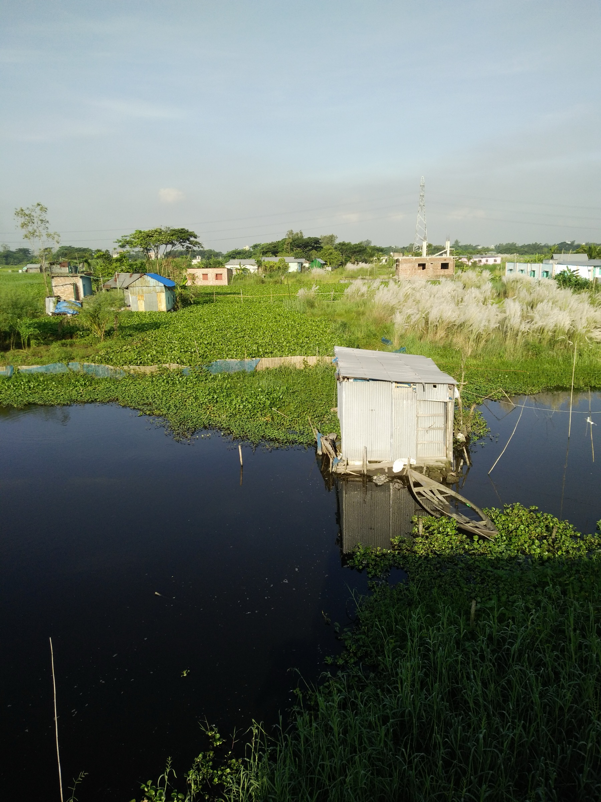
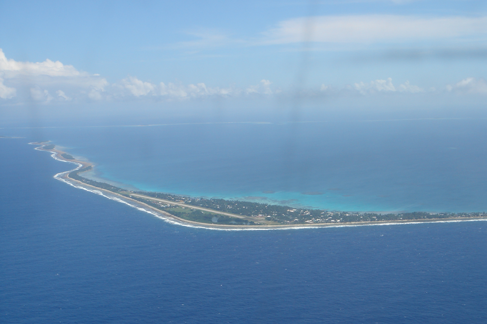
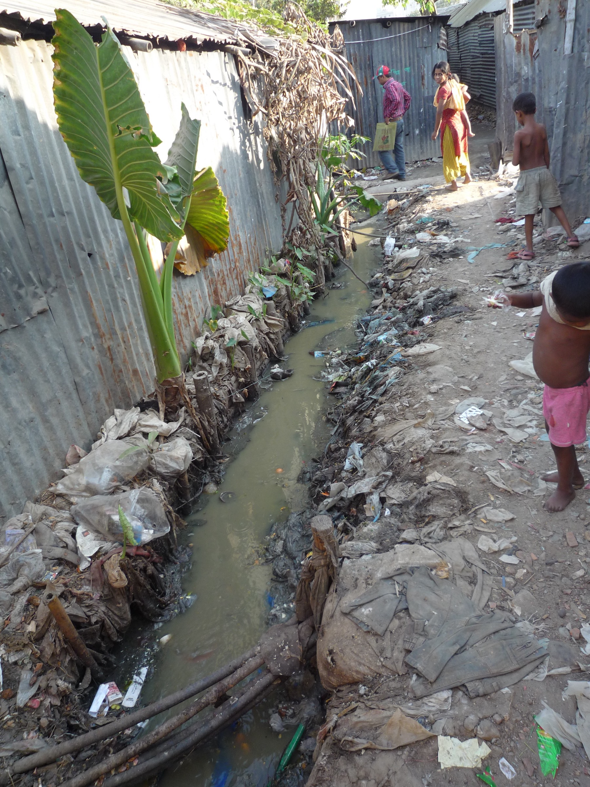
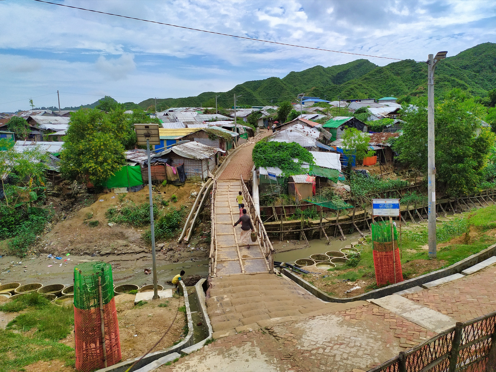
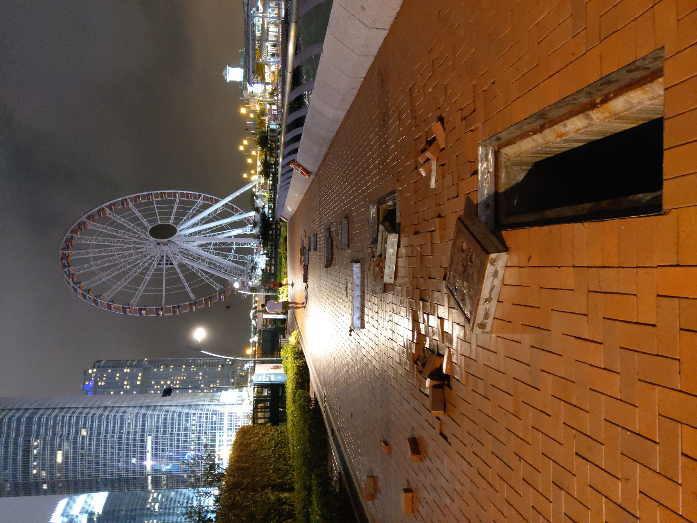

# Last Week's Strategy: The Fork

---

## Quick Callback

::: {style="font-size: 1.6em; line-height: 1.8;"}
Last week's strategy: **The Fork**

*Two options, both yours.*

**Anyone try it?** Did you present two choices that both supported your case?
:::

---

## Something You Took Away Last Week

::: {style="font-size: 1.5em; line-height: 1.8;"}
Week 8 showed you that the **ocean — invisible to most of us — is doing the heavy lifting.**

It absorbs 30% of our CO₂. It traps 90% of excess heat. It feeds 500 million people through coral reefs alone.

And yet: the Great Pacific Garbage Patch exists. 46% of it is fishing nets, not consumer plastic. The biggest damage comes from industries most people never see.
:::

::: {style="font-size: 1.4em; margin-top: 30px; font-weight: bold; color: #8e44ad;"}
What you can't see still matters most. And today: the people who suffer most are also **invisible.**
:::

---

## Quick W8 Recap: The Invisible Infrastructure

::: {style="font-size: 1.4em; line-height: 1.8;"}
Three things from last week you need to hold onto:

**1. The ocean is a climate machine** — thermohaline circulation, carbon pump, phytoplankton producing 50% of oxygen. Break the ocean, break the climate.

**2. The physics is certain** — warming and acidification are measurably reducing the ocean's capacity. The emerging biology (trawling, microplastics) is compounding the damage.

**3. The decolonization** — the ocean was colonized by the wrong narratives (resource, consumer guilt, Western-only knowledge). We stripped those away.
:::

::: {style="font-size: 1.5em; margin-top: 25px; font-weight: bold; color: #c0392b;"}
Now: the ocean is rising. Who drowns first — and whose fault is it?
:::

---

## From Invisible Systems → Invisible People

::: {style="font-size: 1.5em; line-height: 1.8;"}
Last week: *"What we can't see (the ocean) matters most."*

This week: *"The people who suffer aren't the ones who caused it."*

**Responsibility asymmetry.**

The Carteret Islands are sinking. Their residents produce virtually zero carbon. The nations that do? They're building sea walls for themselves.
:::

::: {style="font-size: 1.3em; margin-top: 25px; background: #f0f0f0; padding: 20px; border-radius: 10px;"}
Your toolkit: Spectacle Formula → Complexity → System Boundaries → Timing → Built Environment → Structural Incentives → The Doubt Machine → Invisible Infrastructure → **now: Responsibility Asymmetry.**
:::

---

## Coming Up: Week 10 Preview

::: {style="font-size: 1.5em; line-height: 1.8; background: #2c3e50; color: white; padding: 40px; border-radius: 15px;"}
Next week, we watch a system **cascade.**

One change triggers another, triggers another. Wolves reintroduced to Yellowstone changed the course of rivers. Remove one species, the whole ecosystem shifts.

**Cascade effects:** small changes, catastrophic consequences.
:::

---

## {background-color="#000000"}

::: {style="text-align: center;"}

:::

::: {style="font-size: 1.5em; text-align: center; color: #ccc; margin-top: 20px;"}
**Tuvalu's Foreign Minister addressed COP26 standing in the ocean.**

*The podium was where dry land used to be.*
:::

::: {.notes}
**Engagement prompt:** "If Tuvalu disappears, is it still a country? Do its citizens keep their nationality? Who owns the ocean where the land used to be?"

Quick poll: "Hands up if you'd ever heard of Tuvalu before this class." (Makes the "invisible people" point viscerally.)
:::

---

## {background-color="#1a1a2e"}

::: {style="font-size: 2em; color: white; text-align: center; line-height: 1.6;"}
Before we go any further — a question.

Should we consider the people displaced by the **Tai Po fire** in Hong Kong

[**climate refugees?**]{style="color: #e74c3c; font-size: 1.3em;"}
:::

::: {style="font-size: 1.4em; color: #95a5a6; margin-top: 30px; text-align: center;"}
*Hold that thought. We'll come back to it.*
:::

::: {.notes}
**Do NOT answer this yet.** Let it sit. This is an Open Loop (Strategy #1 from Week 1). Students will carry this question through the entire lecture — measuring every global example against it. When you return to it in the HK section with the dry season data, the payoff will be much stronger.
:::

---

# This Week's Battlefield

---

## Two Sides. Two Responses to Displacement.

::: {style="display: flex; justify-content: space-around; margin-top: 50px;"}
::: {style="text-align: center; width: 45%; background: #27ae60; color: white; padding: 50px; border-radius: 15px;"}
::: {style="font-size: 2.5em; font-weight: bold;"}
PRO-CLIMATE
:::
::: {style="font-size: 1.3em; margin-top: 20px;"}
= Open Borders, Shared Responsibility

= "We caused this — we must help"
:::
:::

::: {style="text-align: center; width: 45%; background: #3498db; color: white; padding: 50px; border-radius: 15px;"}
::: {style="font-size: 2.5em; font-weight: bold;"}
PRO-DEVELOPMENT
:::
::: {style="font-size: 1.3em; margin-top: 20px;"}
= Invest in Resilience, Not Relocation

= "Absorption without integration is not rescue"
:::
:::
:::

---

## The Core Tension

::: {style="font-size: 1.5em; line-height: 1.8;"}
| PRO-CLIMATE | PRO-DEVELOPMENT |
|-------------|-----------------|
| Rich nations caused this crisis | National security matters too |
| Moral obligation to accept refugees | Aid in origin communities first |
| Climate refugees need legal status | "Climate refugee" has no legal definition |
| Open doors save lives | Uncontrolled absorption destabilizes |
| Global solidarity | Protect local communities first |

**This tension drives every migration and climate justice debate.**
:::

---

# What Is a Climate Refugee?

---

## {background-color="#000000"}

::: {style="text-align: center;"}
{width="65%"}
:::

::: {style="font-size: 1.5em; text-align: center; color: #ccc; margin-top: 20px;"}
*This family didn't burn fossil fuels. The river ate their home anyway.*
:::

---

## The Definition Problem

::: {style="font-size: 1.5em; line-height: 1.8;"}
**Climate refugees** are people forced to leave their homes because of climate-driven environmental change — sea-level rise, desertification, flooding, extreme weather.

**The legal gap:** The 1951 UN Refugee Convention only covers people fleeing **war or persecution.** Water, not war, took these people's homes — so the UN says they're not refugees.

**The numbers:**

- **80+ million** forcibly displaced people worldwide (UNHCR, 2020)
- World Bank projects up to [**216 million**]{style="color: #e74c3c;"} displaced by climate by 2050
- 86M in Sub-Saharan Africa, 49M in East Asia & Pacific, 40M in South Asia
:::

---

## {background-color="#1a1a2e"}

::: {style="font-size: 2.5em; color: white; text-align: center; line-height: 1.6;"}
[**216 million**]{style="color: #e74c3c;"} climate refugees by 2050.

Zero have legal refugee status.
:::

::: {style="font-size: 1.4em; color: #95a5a6; margin-top: 30px; text-align: center;"}
*The UN doesn't recognise them. International law doesn't protect them. They're invisible.*
:::

::: {.notes}
**Engagement prompt:** "The 1951 Refugee Convention protects people fleeing war but not water. Should it be updated? Or is 'climate refugee' a category that would break the system — because the numbers are too large for any legal framework to handle?"
:::

---

# What's Driving the Displacement?

---

## Three Forces, One Outcome

::: {style="font-size: 1.4em; line-height: 1.8;"}
**1. Sea-Level Rise**

- Low-lying nations like Kiribati, Tuvalu, and the Maldives face existential threats
- Bangladesh loses an estimated **500 km²** of land per year to river erosion and flooding

**2. Desertification**

- The Sahara expands southward. Lake Chad has shrunk by **90%** since the 1960s.
- East Africa faces recurring droughts that destroy harvests and force migration

**3. Extreme Weather**

- Typhoons, hurricanes, and floods are intensifying — Typhoon Haiyan displaced **4 million** in the Philippines alone
- Each event pushes more people past the threshold of recovery
:::

---

# Case Study 1: Tuvalu — The Sinking Nation

---

## {background-color="#000000"}

::: {style="text-align: center;"}
{width="80%"}
:::

::: {style="font-size: 1.5em; text-align: center; color: #ccc; margin-top: 20px;"}
*This is a country. All of it. And it's disappearing.*
:::

---

## Tuvalu in Numbers

::: {style="font-size: 1.5em; line-height: 1.8;"}
- **Population:** ~11,000 people across 9 atolls
- **Highest point:** 4.6 metres above sea level
- **Average elevation:** 2 metres
- **Carbon emissions:** effectively **zero** in global terms
- **Fate at current projections:** largely uninhabitable by 2100

In 2023, Tuvalu signed an agreement with Australia granting climate refuge to its citizens — the first treaty of its kind.

[**An entire nation negotiating its own extinction.**]{style="color: #e74c3c;"}
:::

---

# Case Study 2: Bangladesh — The Absorption Crisis

---

## {background-color="#000000"}

::: {style="text-align: center;"}
{width="65%"}
:::

::: {style="font-size: 1.5em; text-align: center; color: #ccc; margin-top: 20px;"}
*They were relocated. They were not rescued.*
:::

---

## The Bangladesh Trap

::: {style="font-size: 1.4em; line-height: 1.8;"}
Bangladesh is the world's laboratory for climate displacement — and the results are damning.

**The problem:** Rivers like the Meghna and Padma erode their banks, swallowing entire villages overnight. An estimated [**50,000–200,000 people**]{style="color: #e74c3c;"} are displaced by river erosion every year.

**Where they go:** Dhaka. About [**2,000 climate refugees arrive daily**]{style="color: #e74c3c;"}, ending up in slums with no sanitation, no jobs, no infrastructure.

**The UN's offer:** Emergency shelter, temporary food aid, basic healthcare. Not a livelihood. Not a future.

**The result:** Permanent dependency. People can't go back (the land is gone). They can't build a new life (no legal status, no employment support). They're stuck.
:::

---

## {background-color="#1a1a2e"}

::: {style="font-size: 2em; color: white; text-align: center; line-height: 1.6;"}
Bangladesh shows us the future of climate refugee policy:

**Absorb** without **integrating** = permanent displacement.

[**Relocation without livelihood is not rescue. It's warehousing.**]{style="color: #e74c3c;"}
:::

::: {style="font-size: 1.4em; color: #95a5a6; margin-top: 30px; text-align: center;"}
*This is the "sponge" model: cities absorb refugees until they can't. Then what?*
:::

::: {.notes}
**Engagement prompt:** "2,000 people arrive in Dhaka every day. What if 2,000 climate refugees arrived in Hong Kong every day? Where would they live? What would they do? How long before you'd notice?"

Alternative (more personal): "Your family's village just got swallowed by a river. You have 24 hours. What do you take? Where do you go? Who helps you?"
:::

---

## See It: Bangladesh's Climate Refugees



::: {style="font-size: 1.1em; margin-top: 10px; color: #7f8c8d; text-align: center;"}
*DW Documentary (~42 min — watch from 3:00 to 12:00 for the river erosion and Dhaka displacement). 2,000 climate refugees arrive in Dhaka every day. The city is at breaking point.*
:::

---

# Case Study 3: Venice vs. Bangladesh — Same Water, Different Resources

---

## {background-color="#000000"}

::: {style="text-align: center;"}
{width="55%"}
:::

::: {style="font-size: 1.5em; text-align: center; color: #ccc; margin-top: 20px;"}
*Venice floods. Venice also has a €5.5 billion flood barrier system.*
:::

---

## The Contrast

::: {style="font-size: 1.5em; line-height: 1.8;"}
**Venice** and **Bangladesh** face the same problem: water rising where people live.

| | Venice | Bangladesh |
|--|--------|------------|
| **Response** | MOSE barrier (€5.5B) | Emergency shelters |
| **Infrastructure** | Automated flood gates | Sandbags |
| **Displacement** | Tourists inconvenienced | Villages erased |
| **Global sympathy** | "Save Venice!" campaigns | Barely makes the news |
| **CO₂ contribution** | Significant (Italy = industrialised) | Negligible per capita |
:::

::: {style="font-size: 1.4em; margin-top: 20px; font-weight: bold; color: #c0392b;"}
Same water. Same physics. Wildly different outcomes. **That's responsibility asymmetry.**
:::

::: {.notes}
**Engagement prompt:** "Venice gets a €5.5 billion flood barrier. Bangladesh gets sandbags. Both are coastal flooding. What's the actual difference?" Let them say "money." Then push: "So the right to not drown is a function of GDP?"
:::

---

# The Responsibility Question

---

## Who Caused This?

::: {style="font-size: 1.4em; line-height: 1.8;"}
**Cumulative historical emissions** (who put the most CO₂ in the atmosphere):

1. **United States** — 25% of all cumulative emissions since 1750
2. **EU** — 22%
3. **China** — 13% (but rising fast)

**Who suffers most:**

- **Sub-Saharan Africa** — 4% of cumulative emissions, 86 million projected displaced
- **South Asia** — 8% of emissions, 40 million projected displaced
- **Small Island States** — statistically 0% of emissions, facing **national extinction**
:::

::: {style="font-size: 1.4em; margin-top: 20px; font-weight: bold; color: #c0392b;"}
The nations that industrialised on fossil fuels built sea walls. The nations that didn't are drowning.
:::

::: {.notes}
**Engagement prompt:** "Should historical emissions count, or only current ones? China says: 'you industrialised for 200 years, now it's our turn.' The US says: 'China is the biggest emitter RIGHT NOW.' Who's right?"

Follow-up: "If your great-grandfather's factory caused the emissions, are YOU responsible? When does historical debt expire?"
:::

---

## {background-color="#000000"}

::: {style="text-align: center;"}
{width="80%"}
:::

::: {style="font-size: 1.5em; text-align: center; color: #ccc; margin-top: 20px;"}
*This camp holds over 800,000 people. Climate projections suggest 216 million displaced by 2050.*
:::

---

## The Policy Gap

::: {style="font-size: 1.5em; line-height: 1.8;"}
The tools we have don't fit the problem:

- **The 1951 Refugee Convention** doesn't cover climate displacement
- **The Paris Agreement** mentions "displacement" once — in a non-binding section
- **The Green Climate Fund** exists but is chronically underfunded
- **National policies** range from Australia's Tuvalu deal (progress) to most nations' approach (nothing)

**The gap:** We have a framework for people fleeing war. We have no framework for people fleeing water.
:::

---

# Let's Bring It Back to HK

---

## {background-color="#000000"}

::: {style="text-align: center;"}
{width="55%"}
:::

::: {style="font-size: 1.5em; text-align: center; color: #ccc; margin-top: 20px;"}
*This happened here. To you. Mangkhut was a preview.*
:::

::: {.notes}
**Engagement prompt:** "Mangkhut was a Category 5. HK recovered in weeks. What happens when a Category 5 hits every year? At what point does HK become the place people flee FROM, not just TO?"
:::

---

## Hong Kong's Own Vulnerability

::: {style="font-size: 1.4em; line-height: 1.8;"}
**Geographical risk:** Typhoon Mangkhut (2018) caused widespread flooding and damage — and storms are intensifying.

**Housing crisis meets climate crisis:** HK already has one of the world's most unaffordable housing markets. Where would climate refugees go?

**Current refugees:** HK hosts ~13,000 asylum seekers with no path to permanent residency. Non-refoulement policy offers protection but no stability.

**Poverty:** 23.6% poverty rate alongside one of the highest concentrations of millionaires globally. Climate disruption hits the bottom hardest.
:::

::: {style="font-size: 1.3em; margin-top: 20px; font-weight: bold; color: #c0392b;"}
Hong Kong isn't just a spectator to this crisis. It's a coastal city with 7.5 million people, dense infrastructure, and rising seas.
:::

---

## HK's Dry Season Is Changing

::: {style="font-size: 1.4em; line-height: 1.8;"}
Hong Kong's **annual rainfall** isn't declining — it's actually slightly increasing. But look closer:

- The **wet season** (May–Sept) is getting wetter — more rain in fewer, more intense storms
- The **dry season** (Nov–Feb) is becoming more **extreme** — when it's dry, it's *very* dry
- The **contrast** between wet and dry is intensifying — wetter wets, drier dries
- Winter temperatures are rising faster than summer → higher evaporation → effectively drier even without less rain

The Hong Kong Observatory's own climate projections: **dry spells will become more variable, with greater likelihood of prolonged dry periods.**
:::

::: {style="font-size: 1.3em; margin-top: 20px; font-style: italic; color: #7f8c8d; text-align: center;"}
Source: HKO climate summaries; IPCC AR6 on Hadley cell expansion in subtropical regions.
:::

---

## When the Climate Shifts but Operations Don't

::: {style="font-size: 1.4em; line-height: 1.8;"}
Hong Kong wraps its buildings in **bamboo scaffolding** — a practice older than the skyline. Cheap, fast, flexible. Used on buildings up to 70+ stories.

Bamboo is wood. It burns. And it's wrapped in **nylon mesh sheeting** — highly flammable, acts as an accelerant, creates a chimney effect up the building facade.

**What hasn't changed:**

- Construction workers still smoke on site — the historical ignition source
- Bamboo scaffolding is still erected the same way it was decades ago
- Enforcement of fire-resistant sheeting requirements is inconsistent

**What HAS changed:**

- The dry season hits harder and lasts longer
- Relative humidity drops lower
- Dry bamboo + dry wind + nylon mesh + a cigarette = the same equation, with worse odds
:::

---

## The Tai Po Question

::: {style="font-size: 1.6em; line-height: 1.8; background: #1a1a2e; color: white; padding: 40px; border-radius: 15px;"}
People were displaced by the Tai Po fire.

The fire spread because conditions were dry.

The conditions were dry because the climate is shifting.

[**Are the people displaced by that fire climate refugees?**]{style="color: #e74c3c;"}
:::

::: {style="font-size: 1.3em; margin-top: 20px;"}
The causal chain: climate change → intensified dry season → drier bamboo scaffolding → faster fire spread → homes destroyed → displacement.

In some sense, **it's only climate that allowed the fire to behave the way it did.**
:::

---

## Where Do You Draw the Line?

::: {style="font-size: 1.5em; line-height: 1.8;"}
**If the answer is yes** — then Hong Kong isn't just a potential *host* for climate refugees. It's already **producing** them. The crisis isn't over there. It's here.

**If the answer is no** — then where exactly is the causal boundary? How direct does the climate link need to be?

- Is a Bangladeshi farmer whose river eroded "more" of a climate refugee than a Tai Po family whose building burned?
- What about a farmer in the Sahel whose crops failed because the rains shifted? Climate refugee?
- What about someone in Phoenix who can't afford AC during a record heatwave? Climate refugee?
:::

::: {style="font-size: 1.4em; margin-top: 20px; font-weight: bold; color: #8e44ad;"}
This is Week 3 again: **where you draw the system boundary determines whose problem it is.** And this time, the boundary might include you.
:::

::: {.notes}
**Discussion prompt:** Let this sit for 30 seconds. Then ask: "Raise your hand if you think the Tai Po fire victims are climate refugees." Count hands. Then: "Keep your hand up if you think YOU could become a climate refugee without leaving Hong Kong." Watch the room shift.
:::

---

## The Human Story: The Carteret Islands

::: {style="font-size: 1.4em; line-height: 1.8;"}
**The Carteret Islanders** in Papua New Guinea were the world's first official climate refugees. Rising seas contaminated their freshwater. Crops failed. Their home became unlivable.

**PRO-CLIMATE says:** "They did nothing to cause this. Their carbon footprint is zero. Yet they pay for our emissions with their homeland."

**PRO-DEVELOPMENT says:** "Resettling 3,000 people is manageable. Resettling 216 million is a fantasy. We need to be honest about what's possible."

**The real question:** Who decides who gets to be a refugee — and who gets to stay home?
:::

---

# Building Your Refugee Spectacle

---

## The Formula (Reminder)

::: {style="font-size: 1.8em; line-height: 1.8;"}
**Fact** + **Human Story** + **Stakes** = **Spectacle**
:::

::: {style="display: flex; justify-content: space-around; margin-top: 50px;"}
::: {style="text-align: center; width: 30%; background: #ecf0f1; padding: 30px; border-radius: 10px;"}
::: {style="font-size: 1.2em; font-weight: bold;"}
Weak
:::
"Climate change causes displacement"
:::

::: {style="text-align: center; width: 30%; background: #f39c12; color: white; padding: 30px; border-radius: 10px;"}
::: {style="font-size: 1.2em; font-weight: bold;"}
Better
:::
"216 million climate refugees by 2050"
:::

::: {style="text-align: center; width: 30%; background: #e74c3c; color: white; padding: 30px; border-radius: 10px;"}
::: {style="font-size: 1.2em; font-weight: bold;"}
Spectacle
:::
"Your air conditioner in Kowloon drowns a village in Bangladesh. The survivors will knock on your door by 2050."
:::
:::

---

## PRO-CLIMATE: Make It Personal

::: {style="background: #27ae60; color: white; padding: 40px; border-radius: 15px; font-size: 1.5em; line-height: 1.8;"}
**Don't say:** "Rich nations should accept climate refugees."

**Say:** "Europe industrialized on coal. America grew rich on oil. Now a farmer in the Mekong Delta loses his home because the sea rose. You made his world flood — and you want to close the door?"

**Don't say:** "Climate displacement is a human rights issue."

**Say:** "Kiribati is sinking. The entire country will disappear. 120,000 people with nowhere to go. The UN says they're not refugees because water, not war, took their home."
:::

---

## PRO-DEVELOPMENT: Paint the Picture

::: {style="background: #3498db; color: white; padding: 40px; border-radius: 15px; font-size: 1.5em; line-height: 1.8;"}
**Don't say:** "Uncontrolled migration causes instability."

**Say:** "In 2015, one million refugees entered Germany. Merkel said 'Wir schaffen das.' Now AfD is the second-largest party. Open borders created closed minds."

**Don't say:** "We should help in origin countries."

**Say:** "2,000 climate refugees arrive in Dhaka every day. They end up in slums with open sewers. No jobs. No future. That's what 'absorption' looks like. Is that really rescue?"
:::

---

## Why This Motion?

::: {style="font-size: 1.3em; line-height: 1.8;"}
This debate connects Bangladesh's lived reality to a global policy question:
:::

::: {style="display: flex; justify-content: space-around; margin-top: 20px;"}
::: {style="text-align: left; width: 30%; background: #27ae60; color: white; padding: 25px; border-radius: 10px;"}
::: {style="font-size: 1.2em; font-weight: bold;"}
The Moral Case
:::
::: {style="font-size: 1.1em; line-height: 1.5; margin-top: 10px;"}
You can't tell a farmer whose land is underwater to "adapt at home." When the land is **gone**, there is no home. Refusing relocation is a death sentence.
:::
:::

::: {style="text-align: left; width: 30%; background: #3498db; color: white; padding: 25px; border-radius: 10px;"}
::: {style="font-size: 1.2em; font-weight: bold;"}
The Pragmatic Case
:::
::: {style="font-size: 1.1em; line-height: 1.5; margin-top: 10px;"}
Bangladesh proves absorption doesn't work. 2,000/day into Dhaka slums. No jobs, no sanitation, no future. **Relocation without livelihood is warehousing, not rescue.**
:::
:::

::: {style="text-align: left; width: 30%; background: #8e44ad; color: white; padding: 25px; border-radius: 10px;"}
::: {style="font-size: 1.2em; font-weight: bold;"}
The HK Question
:::
::: {style="font-size: 1.1em; line-height: 1.5; margin-top: 10px;"}
HK can barely house its own population. 23.6% poverty rate. 13,000 asylum seekers with no residency path. **Could HK absorb climate refugees? Should it?**
:::
:::
:::

---

## This Week's Debate Motion

::: {style="font-size: 1.8em; text-align: center; background: #2c3e50; color: white; padding: 50px; border-radius: 15px;"}
**"This house believes that relocating climate refugees to cities is a failed strategy, and that international funding should go to climate-proofing origin communities instead."**
:::

::: {style="font-size: 1.3em; margin-top: 30px; text-align: center;"}
PRO-CLIMATE: Climate-proofing won't save sinking islands. When your land is underwater, there IS no home. Refusing relocation is abandonment.

PRO-DEVELOPMENT: Bangladesh shows absorption fails — Dhaka's slums prove that relocation without integration creates permanent dependency, not rescue.
:::

::: {.notes}
**Engagement prompt (right before debate):** "Here's the uncomfortable question nobody wants to answer: if 216 million people need to move by 2050, and no country wants them — what actually happens? Not what SHOULD happen. What WILL happen?"
:::

---

# Role-Play Activity: The Refugee Debate

---

#

```{=html}
<style>
  #w9groupAssignment_container { text-align: center; margin-top: 20px; font-family: Arial, sans-serif; }
  #w9groupAssignment_startButton { font-size: 24px; padding: 15px 30px; cursor: pointer; background-color: #3498db; color: white; border: none; border-radius: 5px; transition: background-color 0.3s; }
  #w9groupAssignment_startButton:hover { background-color: #2980b9; }
  #w9groupAssignment_overlay { position: fixed; top: 0; left: 0; width: 100%; height: 100%; background-color: rgba(255,255,255,0.9); display: none; justify-content: center; align-items: center; z-index: 1000; }
  #w9groupAssignment_display { font-size: 36px; text-align: center; padding: 20px; max-width: 90%; max-height: 90%; overflow-y: auto; }
  #w9groupAssignment_display h2 { color: #2c3e50; font-size: 48px; margin-bottom: 30px; }
  #w9groupAssignment_display ul { list-style-type: none; padding: 0; }
  #w9groupAssignment_display li { margin: 20px 0; font-size: 36px; background-color: #ecf0f1; padding: 15px; border-radius: 10px; box-shadow: 0 2px 5px rgba(0,0,0,0.1); }
  #w9groupAssignment_closeButton { position: absolute; top: 20px; right: 20px; font-size: 24px; cursor: pointer; background-color: #e74c3c; color: white; border: none; border-radius: 5px; padding: 10px 20px; }
</style>
<div id="w9groupAssignment_container">
  <h1 style="font-size: 48px; color: #34495e;">Group Assignment Time!</h1>
  <button id="w9groupAssignment_startButton">Start the assignment</button>
</div>
<div id="w9groupAssignment_overlay">
  <div id="w9groupAssignment_display"></div>
  <button id="w9groupAssignment_closeButton">Close</button>
</div>
<script>
const W9GroupAssignment = {
  groups: ['Group One','Group Two','Group Three','Group Four','Group Five','Group Six'],
  vocations: ['Climate Refugee','Host City Official','UNHCR Representative','National Government Minister','NGO Aid Worker','Local Resident of Host Community'],
  shuffleArray: function(a){for(let i=a.length-1;i>0;i--){const j=Math.floor(Math.random()*(i+1));[a[i],a[j]]=[a[j],a[i]];}return a;},
  createAssignment: function(){const s=this.shuffleArray([...this.vocations]);return this.groups.map((g,i)=>({group:g,vocation:s[i]}));},
  displayAssignment: function(){const a=this.createAssignment();let h='<h2>Random Group Assignments</h2><ul>';a.forEach(x=>{h+=`<li><strong>${x.group}:</strong> ${x.vocation}</li>`;});h+='</ul>';document.getElementById('w9groupAssignment_display').innerHTML=h;document.getElementById('w9groupAssignment_overlay').style.display='flex';},
  init: function(){document.getElementById('w9groupAssignment_startButton').addEventListener('click',()=>this.displayAssignment());document.getElementById('w9groupAssignment_closeButton').addEventListener('click',()=>{document.getElementById('w9groupAssignment_overlay').style.display='none';});}
};
W9GroupAssignment.init();
</script>
```

## Presentation Countdown

<div id="w9timer-container" style="text-align: center;">
  <div id="w9timer" style="font-size: 348px; color: black; margin-bottom: 20px;">05:00</div>
  <button id="w9start-button" style="font-size: 24px; padding: 15px 30px; cursor: pointer; background-color: #27ae60; color: white; border: none; border-radius: 8px;" onclick="w9startTimer()">Start 5:00</button>
  <button id="w9reset-button" style="font-size: 24px; padding: 15px 30px; cursor: pointer; background-color: #e74c3c; color: white; border: none; border-radius: 8px; margin-left: 10px;" onclick="w9resetTimer()">Reset</button>
</div>

<script>
let w9timeLeft = 300; let w9timerInterval = null;
function w9updateDisplay(){const m=Math.floor(w9timeLeft/60);const s=w9timeLeft%60;document.getElementById('w9timer').textContent=String(m).padStart(2,'0')+':'+String(s).padStart(2,'0');document.getElementById('w9timer').style.color=w9timeLeft<=30?'#e74c3c':'black';}
function w9startTimer(){if(w9timerInterval)return;w9timerInterval=setInterval(()=>{if(w9timeLeft>0){w9timeLeft--;w9updateDisplay();}else{clearInterval(w9timerInterval);w9timerInterval=null;}},1000);}
function w9resetTimer(){clearInterval(w9timerInterval);w9timerInterval=null;w9timeLeft=300;w9updateDisplay();}
w9updateDisplay();
</script>

---

## The Debate

::: {style="font-size: 1.4em; line-height: 1.8;"}
You will assume **stakeholder positions**: Climate Refugees, Host City Officials, UNHCR Representatives, National Government Ministers, NGO Workers, Local Residents of Host Communities.

**Think across scales:**

- **The person** — what does displacement feel like? What do you need?
- **The city** — Dhaka, Hong Kong, Lagos. Can you absorb 2,000 people a day?
- **The system** — who pays? Who decides? What framework would actually work?

The strongest debaters will make the abstract **personal** and the personal **structural**.
:::

---

## Ground Rules

::: {style="font-size: 1.5em; line-height: 1.8;"}
- This is a [**safe space**]{style="color: #27ae60;"} for exploration and discussion. There are [**no wrong answers**]{style="color: #e74c3c;"}, only opportunities to learn.

- **Respect** and **open-mindedness** are our guiding principles. Every opinion shared contributes to collective learning.

- **Feedback** and **reflection** are encouraged. This is a chance to voice thoughts, ask questions, and grow from the experience.
:::

---

# Your Cheatsheet

---

## Pro-Climate Talking Points {.smaller}

::: {style="font-size: 1.3em; line-height: 1.8;"}
**Moral Obligation and Global Solidarity:**

- Rich nations produced **47%** of cumulative emissions — they owe a debt to those displaced by the consequences
- Climate refugees have **no legal status** — the 1951 Convention must be expanded
- Australia's Tuvalu deal (2023) shows it's possible — other nations must follow
- Climate-proofing has limits — you can't climate-proof a nation 2 metres above sea level
- Integration programs (housing, employment, education) make absorption sustainable — Dhaka's failure is a policy failure, not proof that relocation can't work
:::

---

## Pro-Development Talking Points {.smaller}

::: {style="font-size: 1.3em; line-height: 1.8;"}
**Pragmatic Sustainability:**

- **216 million** projected displaced — no city or nation can absorb that. The maths doesn't work.
- Bangladesh proves the "sponge model" fails — absorption without integration creates permanent slums
- **$35 invested in climate adaptation** at origin saves more lives than **$1 in resettlement** (World Bank estimates)
- Host communities suffer too — Germany's 2015 experience shows unmanaged absorption fuels nationalist backlash
- Focus on **climate-proofing infrastructure**, sustainable agriculture, and early warning systems in vulnerable regions
- For genuinely sinking islands: negotiate bilateral agreements (like Tuvalu-Australia) rather than open-border policies
:::

---

# This Week's Conceptual Takeaway

---

## Remember Week 3? System Boundaries.

::: {style="font-size: 1.5em; line-height: 1.8;"}
In Week 3, you learned: **where you draw the boundary changes who looks responsible.**

The same principle applies to climate refugees — and it explains why the "sponge" model fails:
:::

::: {style="display: flex; justify-content: space-around; margin-top: 30px;"}
::: {style="text-align: left; width: 30%; background: #ecf0f1; padding: 25px; border-radius: 10px;"}
::: {style="font-size: 1.2em; font-weight: bold;"}
Boundary: The Refugee
:::
::: {style="font-size: 1.1em; line-height: 1.5; margin-top: 10px;"}
It's a **shelter** problem. Give them a tent. Feed them. Move on.

*This is the UN's current framework.*
:::
:::

::: {style="text-align: left; width: 30%; background: #f39c12; color: white; padding: 25px; border-radius: 10px;"}
::: {style="font-size: 1.2em; font-weight: bold;"}
Boundary: The City
:::
::: {style="font-size: 1.1em; line-height: 1.5; margin-top: 10px;"}
It's an **absorption** problem. Dhaka can't handle 2,000 arrivals/day. Build more infrastructure. Manage the flow.

*This is the "sponge" model.*
:::
:::

::: {style="text-align: left; width: 30%; background: #c0392b; color: white; padding: 25px; border-radius: 10px;"}
::: {style="font-size: 1.2em; font-weight: bold;"}
Boundary: The System
:::
::: {style="font-size: 1.1em; line-height: 1.5; margin-top: 10px;"}
It's a **responsibility** problem. Who caused the emissions that raised the sea? Who profits from the inaction? Who should pay?

*This is where the real debate begins.*
:::
:::
:::

---

## Why the Sponge Model Fails

::: {style="font-size: 1.5em; line-height: 1.8;"}
The "sponge" model — cities absorb displaced people until they can't — fails because it treats displacement as **logistics** instead of **systemic failure.**

- **It ignores the cause.** Moving people from flooded village A to overcrowded city B doesn't address why A flooded.
- **It ignores livelihood.** Dhaka's slums show that relocation without employment, sanitation, and integration creates permanent dependency — not recovery.
- **It ignores the cascade.** Displacement doesn't end when people arrive. It *triggers* the next crisis: urban strain → resource competition → political backlash → more displacement.
:::

::: {style="font-size: 1.4em; margin-top: 20px; font-weight: bold; color: #c0392b;"}
Displacement is not a destination problem. It's the **middle** of a chain — and next week, we follow that chain.
:::

---

## But Wait — What If We're Framing This Wrong?

::: {style="font-size: 1.8em; text-align: center; padding: 40px; background: #0a3d62; color: white; border-radius: 15px; line-height: 1.6;"}
Everything so far assumes refugees are a **burden** to manage.

What if they're a **resource** to leverage?
:::

---

## The Case You Already Live In: Hong Kong

::: {style="font-size: 1.4em; line-height: 1.8;"}
After 1949, **waves of refugees** fled mainland China to Hong Kong. They arrived with nothing.

**What happened next:**

- They brought **labour, skills, and entrepreneurial energy** that powered HK's economic miracle
- The garment industry, manufacturing boom, and eventually finance — **driven by displaced people**
- HK went from a colonial backwater to a global financial centre in **one generation**

[**You are sitting in a city that was built by refugees.**]{style="color: #e74c3c;"}
:::

::: {style="font-size: 1.3em; margin-top: 20px; background: #f9e79f; padding: 20px; border-radius: 10px;"}
**But be honest about the conditions:** those refugees often brought education, capital, and shared language/culture with HK. That's very different from a Bangladeshi farmer arriving in Dhaka with nothing. **The success wasn't automatic — the conditions mattered.**
:::

::: {.notes}
**Engagement prompt:** "Your grandparents — or their grandparents — may have been refugees. Ask your family this week: how did they get to Hong Kong? What did they arrive with?"

Follow-up: "If HK closed its borders in 1949, what would this city look like today?"
:::

---

## Refugees as Resources: The Evidence (and Its Limits)

::: {style="font-size: 1.2em; line-height: 1.6;"}
| Approach | The Claim | The Complication |
|----------|-----------|------------------|
| **Right to work** (Uganda) | 1.5M+ refugees get land, jobs, freedom of movement | System is under severe strain — food insecurity, underfunding, limited healthcare in settlements |
| **Labour integration** (Germany) | Syrian doctors, engineers filled critical gaps in healthcare and tech | Political cost was enormous — AfD surged, housing strained, social tensions fuelled nationalist backlash |
| **Private sponsorship** (Canada) | Community groups sponsor families; integration rates genuinely outperform government-only programs | Most defensible model — but scales slowly and relies on civil society willingness |
| **Entrepreneurship** (US) | Some studies suggest refugees start businesses at higher rates | Data comes from advocacy orgs; contested and context-dependent. Not settled science. |
:::

::: {style="font-size: 1.3em; margin-top: 20px; font-weight: bold; color: #e67e22;"}
None of these is a clean success story. But all of them outperform the sponge model. **The question is whether "imperfect integration" beats "no integration at all."**
:::

::: {.notes}
**Engagement prompt:** "Germany took in one million refugees. The economy got workers. The politics got AfD. Was it worth it? Is that even the right question?"

Follow-up: "Canada's private sponsorship model works best — but it requires ordinary citizens to volunteer time and money. Would YOU sponsor a climate refugee family? What would it actually take?"
:::

---

## The Real Choice

::: {style="font-size: 1.5em; line-height: 1.8;"}
Two models. Same displaced people. Neither is perfect.

**Model A: Suppress** (Dhaka's sponge model)

- No legal status → no employment → no integration → permanent dependency → political backlash

**Model B: Leverage** (imperfect, costly, politically risky)

- Right to work → economic contribution → social tension *and* social benefit → slow, messy integration

The honest answer: **Model B is harder, more expensive, and politically dangerous.** Germany proves that. But Model A produces slums, dependency, and eventually the same backlash anyway — just slower.
:::

::: {style="font-size: 1.4em; margin-top: 20px; font-weight: bold; color: #8e44ad;"}
So the question for your debate isn't just "relocate or climate-proof?" — it's: **if people do move, what system are we building for them — and are we honest about the trade-offs?**
:::

---

## Responsibility Asymmetry

::: {style="font-size: 1.5em; line-height: 1.8; background: #2c3e50; color: white; padding: 40px; border-radius: 15px;"}
Now you know:

- **2,000 people** arrive in Dhaka's slums every day because rivers ate their homes
- **Tuvalu** is negotiating the extinction of an entire nation
- **Venice** and **Bangladesh** face the same water — but Venice has a €5.5 billion barrier system
- The nations that **caused** this are building walls. The nations that **didn't** are drowning.
- And the "sponge" model — absorb, don't integrate — is already failing.
:::

::: {style="font-size: 1.4em; margin-top: 30px; font-weight: bold; color: #8e44ad; text-align: center;"}
**Your portable takeaway:** When someone says "climate refugees," ask three questions: *whose boundary are you drawing?* *What cascade does it trigger?* And: *are you designing a system that suppresses — or one that leverages?*
:::

---

# The Persuasion Playbook | Strategy #8

---

## The Invisible Bandwagon

::: {style="font-size: 1.6em; background: #2c3e50; color: white; padding: 40px; border-radius: 10px;"}
Researchers changed one line in a tax notice:

*"9 out of 10 people in your area pay their taxes on time."*

**Compliance jumped 15%.**

Not moral appeal. Not threats. Just: *you're the weird one if you don't.*
:::

---

## The Science

::: {style="font-size: 1.4em; line-height: 1.8;"}
This is **Social Proof** + **Normative Messaging**.

But the key is: **local and specific**.

- "Most people" → weak
- "Most people in your building" → strong
- "Most people in your building with kids your age" → irresistible

**The more similar the reference group, the more powerful the pull.**
:::

---

## You Just Saw It

::: {style="font-size: 1.6em; line-height: 1.8;"}
The best arguments today didn't say "people care about climate."

They said:

*"Engineers at HKU are already shifting their research priorities."*

A bandwagon that didn't exist until you named it.
:::

---

## Next Week's Challenge

::: {style="font-size: 2em; background: #e74c3c; color: white; padding: 40px; border-radius: 10px; text-align: center;"}
**Create a bandwagon for your argument.**

Make it local. Make it specific. Make them the outlier if they disagree.
:::

---

## Logistics: Final Assessment Items — Quick Q&A

::: {style="font-size: 1.3em; line-height: 1.8;"}
**Q: What topic should I pick?** Within or outside of in-lecture ones? Consistent theme across all three items?
**A:** Up to you.

**Q: What should the final reflection paper be about?**
**A:** What you think should be **our response to Climate Change at Hong Kong for 2100.**

**Q: Can we see collage/video examples?**
**A:** Refer to the 'Roadmap' document.

**Q: How do I make videos?**
**A:** Script matters more than production quality. Voice-over on still images works. Clips stitched with slogans works.
:::
